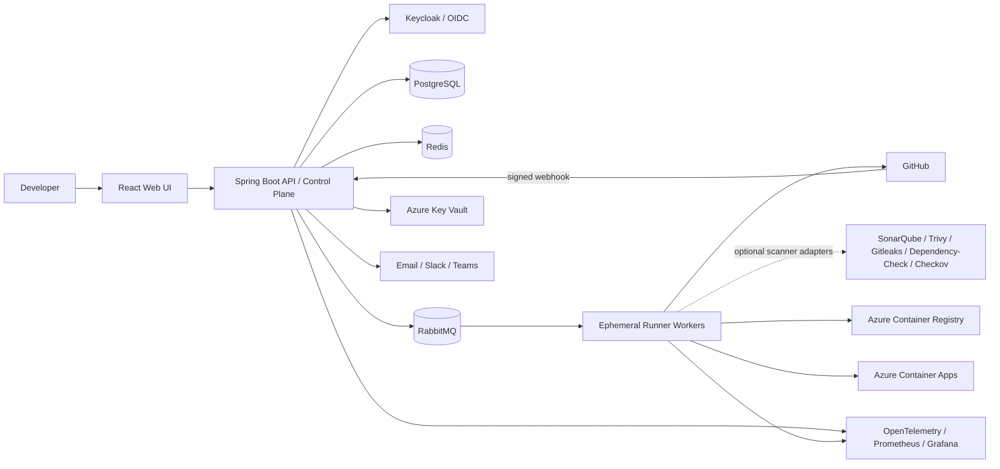
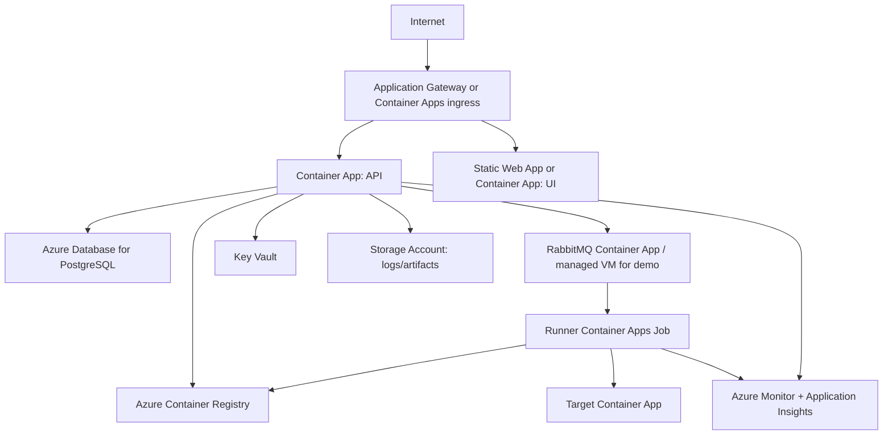
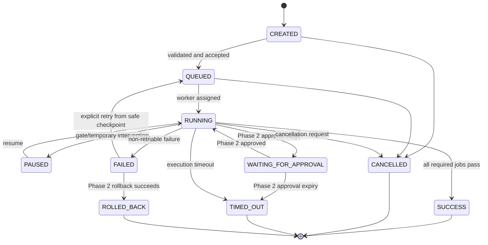
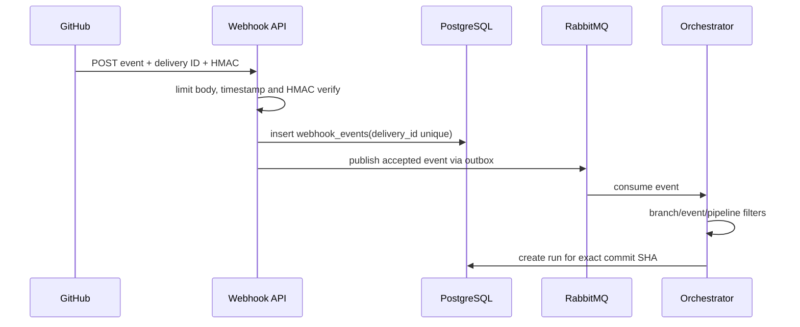
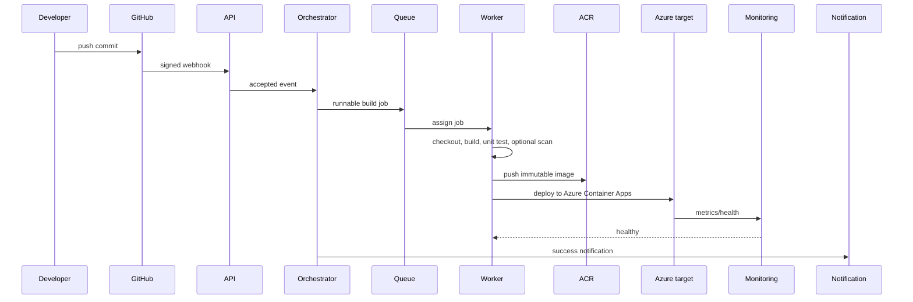
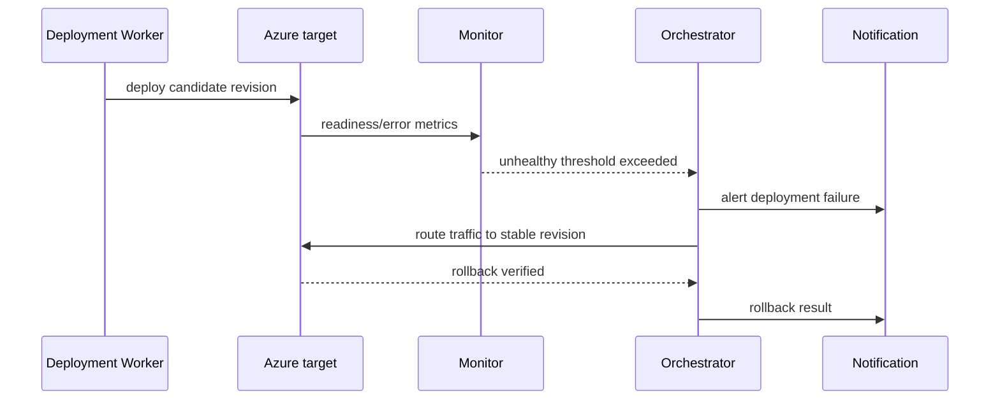
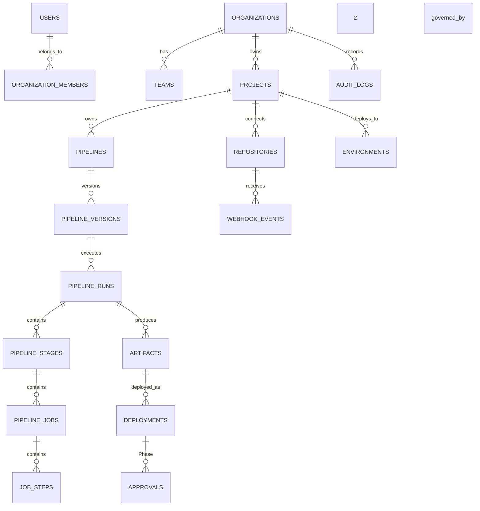
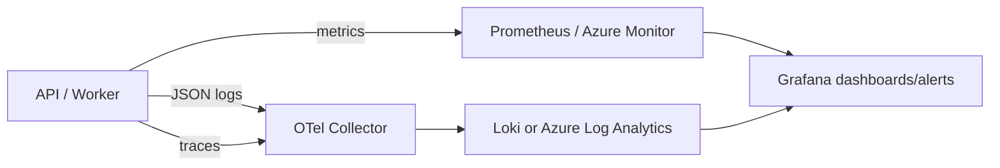

# Enterprise CI/CD Automation Platform — Implementation Blueprint

> **Document status:** implementation specification  
> **Audience:** final-year project team, reviewers, and future maintainers  
> **Scope principle:** build a credible, secure MVP first; evolve it into an internal developer platform (IDP) without redesigning its core.

## Table of Contents

1. [Executive summary and objective](#1-executive-summary-and-objective)
2. [Problem statement and vision](#2-problem-statement-and-vision)
3. [Scope, assumptions, and requirements](#3-scope-assumptions-and-requirements)
4. [Architecture and technology decisions](#4-architecture-and-technology-decisions)
5. [Azure deployment architecture](#5-azure-deployment-architecture)
6. [Pipeline engine and execution model](#6-pipeline-engine-and-execution-model)
7. [Security, RBAC, and tenancy](#7-security-rbac-and-tenancy)
8. [Data model and API contract](#8-data-model-and-api-contract)
9. [Operations, reliability, and governance](#9-operations-reliability-and-governance)
10. [Frontend and repository structure](#10-frontend-and-repository-structure)
11. [Implementation roadmap and testing](#11-implementation-roadmap-and-testing)
12. [Experimental evaluation and benchmarking](#114-experimental-evaluation-and-benchmarking)
13. [Deployment, checklists, and troubleshooting](#12-deployment-checklists-and-troubleshooting)
14. [Positioning, glossary, and presentations](#13-positioning-glossary-and-presentations)

---

## 1. Executive Summary and Objective

### 1.1 Project objective

Build an enterprise-oriented CI/CD orchestration platform that connects a Git repository, receives a verified source-control event, executes a versioned pipeline, stores immutable artifacts, deploys the same artifact through environments, and records every significant action. It is **not** a replacement for Jenkins, GitHub Actions, GitLab CI, or Azure DevOps; it is an educational yet production-minded platform showing how these systems are designed and integrated.

The mandatory MVP delivery path is:

```text
Developer push → GitHub webhook → webhook verification/idempotency → pipeline YAML validation
→ RabbitMQ → isolated worker → Maven build → unit tests → Docker image
→ Azure Container Registry push → Azure Container Apps deployment → dashboard status/logs
```

Optional scanner integrations and the production-governance path (approval, production deployment, and automated rollback) are Future Scope / Phase 2, not part of this MVP flow.

### 1.2 Success criteria

The MVP is successful when an authenticated user connects a GitHub repository, commits a pipeline YAML file, and a GitHub push reliably completes this demonstrable flow: verified webhook -> one idempotent pipeline run -> YAML validation -> RabbitMQ job -> isolated worker -> Maven build -> unit tests -> Docker image -> ACR push -> Azure Container Apps deployment -> dashboard status and logs. The MVP also provides basic project/repository management, RBAC, error handling, and audit events. Every action is attributable to a user, service, or webhook delivery. Production approval and automated rollback are optional extensions, not MVP exit criteria.

### 1.3 Design assumptions

| Assumption | Decision |
|---|---|
| Team size | 2–5 students over 12–16 weeks |
| First SCM integration | GitHub only; GitLab and Bitbucket are Phase 2 |
| First application type | Containerized HTTP service |
| Cloud | Azure subscription available; Docker Compose used locally |
| MVP deployment target | Azure Container Apps, not Kubernetes |
| Backend | Java 21 + Spring Boot 3 modular monolith |
| Trust boundary | Worker execution is isolated from the control-plane API |

---

## 2. Problem Statement and Vision

### 2.1 Problems solved

| Problem | Impact | Proposed solution |
|---|---|---|
| Manual deployments | Slow, error-prone releases | Versioned, repeatable deployment jobs |
| Environment drift | “Works on my machine” failures | Docker images, Terraform, environment configuration contracts |
| Fragmented tools | No release visibility | One dashboard for runs, artifacts, and deployments; approvals in Phase 2 |
| Missing automated tests | Defects reach users | Required test stages and quality gates |
| Vulnerable dependencies/secrets | Security and compliance exposure | MVP secret handling and optional/Phase 2 SAST, dependency, image, IaC, and secret scanning |
| Difficult rollback | Longer outages | Stable-release pointer and idempotent rollback deployment in Phase 2 |
| Weak audit trail | Unclear accountability | Append-only audit events with actor and correlation ID |
| Inconsistent approvals | Unauthorized production changes | Environment-scoped, role-based approval gate in Phase 2 |
| Configuration drift | Infrastructure is irreproducible | Terraform plans and reviewed infrastructure code |

### 2.2 Long-term vision: internal developer platform

An IDP gives developers self-service “golden paths”: create a project from a template, connect source control, use a supported pipeline, deploy safely, and observe the result without manually assembling cloud infrastructure. This platform evolves toward that vision by adding reusable pipeline templates, service catalog metadata, policy checks, SSO, tenant controls, and platform-managed environments. The MVP intentionally stops before those advanced features.

---

## 3. Scope, Assumptions, and Requirements

### 3.1 Functional requirements

| Domain | MVP requirement | Later capability |
|---|---|---|
| Identity | OIDC login/logout and basic `ADMIN`, `DEVELOPER`, `VIEWER` RBAC | Entra ID SSO, SCIM, separation of duties |
| Projects | Project and repository CRUD for a demonstrable organization | Multiple organizations, teams, quotas, hardened tenancy |
| Repositories | GitHub connection and verified, idempotent push webhooks | GitLab and Bitbucket adapters, PR automation |
| Pipelines | YAML validation, persistence, manual trigger, run history | Templates, schedules, policy-as-code, reusable libraries |
| Build/test | Maven build and JUnit unit-test execution/results | Other build ecosystems, test sharding, E2E pools |
| Security | Secret redaction, least privilege, webhook verification, worker isolation | SAST/dependency/image/IaC gates, DAST, signing, advanced SBOM/provenance |
| Artifacts | Docker image metadata and ACR push | Generic packages, promotion workflows, artifact signing |
| Deployments | One Azure Container Apps target and deployment status | Multiple environments, approvals, blue-green/canary, GitOps |
| Operations | Status, logs, basic dashboard, error handling, basic audit log | SLOs, advanced alerting, analytics, full compliance reporting |
| Recovery | Clear failed state and operator runbook | Automated or advanced rollback workflows |

#### User, project, and repository behavior

Users authenticate through OIDC; the backend never stores user passwords. A project owns repositories, environments, pipelines, artifacts, and deployment history. A repository has allowed branches, an encrypted reference to its integration credential, and one webhook secret held only in Key Vault. Webhook events are durable and idempotent.

#### Pipeline, quality, security, artifact, and deployment behavior

The system must record run/job state, timestamps, exit code, logs, and output image digest. It validates only the supported MVP YAML actions and deploys the image produced by the same run. Quality/security gates, approval exceptions, and production promotion policy are Phase 2 extensions.

#### MVP security and optional scanner scope

**Mandatory MVP security:** webhook HMAC verification; authentication and authorization; least-privilege identities; Key Vault secret handling; secret redaction/masking; isolated workers; resource/time limits; a safe pipeline-action allowlist; and secure API validation.

**Optional MVP / Phase 2 scanner integrations:** Gitleaks, Trivy, SonarQube, OWASP Dependency-Check, and Checkov. These adapters may be demonstrated if time permits, but none is required for MVP completion. Advanced security gates remain Phase 2.

### 3.2 Non-functional requirements

| Requirement | Why it matters | Architecture response |
|---|---|---|
| Security | Runners execute untrusted repository code | Isolated workers, least-privilege identities, Key Vault, signed webhooks |
| Reliability | A run must not be lost on restart | PostgreSQL source of truth, durable queue, idempotency keys |
| Availability | UI/API should remain usable during worker failures | Stateless API replicas, health checks, async execution |
| Scalability | Builds are bursty | Queue-backed horizontal worker pools and concurrency limits |
| Performance | Feedback must be prompt | Indexed run queries and streamed/chunked logs; add Redis only if measurements justify it |
| Maintainability | Student project must remain understandable | Modular monolith, hexagonal boundaries, testable adapters |
| Observability | Failures require evidence | JSON logs, OpenTelemetry, Prometheus, correlation IDs |
| Portability | Local development and Azure should align | Docker Compose and Terraform; provider adapters |
| Auditability | Production actions need accountability | Immutable audit append model and actor context |
| Data consistency | Incorrect states create unsafe deployments | Transactional state transitions and outbox event publishing |

### 3.3 Acceptance criteria

1. Invalid YAML, unauthorized calls, bad webhook signatures, and stale/replayed deliveries are rejected with an auditable reason.
2. A queued job survives API restart; a worker crash causes a safe retry or a clear terminal failure.
3. A successful run builds/tests a pinned commit, pushes one image to ACR, and deploys it to Azure Container Apps.
4. The dashboard shows pipeline history, current state, job/stage status, and redacted logs linked to project, pipeline run, job, and correlation ID.
5. Terraform can recreate the MVP cloud resources from a clean Azure subscription.

### Scope Boundaries

This is a final-year educational and experimental CI/CD orchestration platform. It demonstrates CI/CD architecture, pipeline orchestration, asynchronous job execution, worker isolation, cloud deployment, security practices, observability, and DevOps automation. It does **not** attempt to reproduce the full functionality, scale, plugin ecosystem, or enterprise maturity of Jenkins, GitHub Actions, GitLab CI, or Azure DevOps. Advanced enterprise capabilities remain documented as Future Scope / Phase 2 so the architecture can evolve without making them student-project requirements.

---

## 4. Architecture and Technology Decisions

### 4.1 Simple explanation

The **control plane** is the web app and API that decide what should happen. The **data plane** is the worker that actually builds, scans, and deploys code. Separating them prevents a repository build from having direct access to the web application or database.

### 4.2 High-level architecture



### 4.3 Component responsibilities and initial boundary

| Component | MVP form | Responsibility |
|---|---|---|
| API gateway | Ingress/reverse proxy | TLS, request size limits, routing, rate limits |
| Authentication | Keycloak external service | OIDC login and token issuance |
| Authorization | Backend module | Enforce organization/project/environment RBAC |
| Project/repository/pipeline | Backend modules | Configuration and lifecycle APIs |
| Orchestrator/scheduler | Backend module | Validate DAG, select runnable jobs, transition states |
| Queue | RabbitMQ service | Durable asynchronous job dispatch |
| Runner | Separate worker service | Clone, execute tools, collect logs/results |
| Artifact/deployment | Backend modules plus adapters | Metadata, registry and Azure deployment calls |
| Approval/audit/notification | Audit module in MVP; approval/notification extensions later | Append-only history; Phase 2 governance and event delivery |
| Observability | Shared platform services | Metrics, logs, traces, alerting |

### 4.4 Modular monolith vs microservices

Start with a modular monolith: one deployable Spring Boot API with packages that communicate through interfaces and domain events. It is easier to debug, test, deploy, and evolve. Keep workers separate because they execute untrusted code and scale independently. Extract a module into a microservice only when it needs independent scaling, security isolation, release cadence, or ownership—likely notification, analytics, or runner coordination at enterprise scale. Do not create twenty services for a student MVP.

### 4.5 Selected technology stack

| Area | Selected | What/why | Alternative and trigger to change |
|---|---|---|---|
| Frontend | React + TypeScript + Vite | Fast SPA dashboard and strong component ecosystem | Next.js if SSR/public pages become needed |
| Backend | Java 21, Spring Boot 3 | Mature security, validation, async integrations, strong typing | FastAPI for a Python-heavy team; select one, not both |
| Database | PostgreSQL | Transactions, JSONB, indexing, reliability | MongoDB only for highly document-centric, weakly relational workloads |
| Cache | Redis | Short-lived cache, rate limit counters, distributed locks | Omit initially only if load is tiny; do not store truth here |
| Queue | RabbitMQ | Simple durable work queue, acknowledgements, DLQ | Kafka for high-volume event streaming/analytics, not MVP |
| Identity | Keycloak + OIDC/JWT | Self-hostable standards-based auth/RBAC integration | Azure Entra ID for enterprise SSO |
| Containers | Docker | Reproducible build/runtime unit | Podman is compatible alternative |
| Registry | Azure Container Registry | Azure-native private OCI registry | GHCR for GitHub-focused/no-Azure MVP |
| IaC | Terraform | Reviewable, repeatable Azure infrastructure | Bicep if Azure-only team prefers it |
| Compute | Azure Container Apps | Managed containers without Kubernetes operations | AKS for advanced worker isolation/scale |
| Metrics/traces | Prometheus, Grafana, OpenTelemetry | Vendor-neutral signals | Azure Monitor/App Insights can be primary hosted backend |
| Logs | Loki + Grafana (local) | Lightweight label-based logs | OpenSearch for full-text/security analytics later |
| Scanners (optional MVP / Phase 2) | SonarQube, Trivy, Gitleaks, Dependency-Check, Checkov | Optional code, dependency, secret, image, and IaC scanning adapters | Keep scanner adapters replaceable; do not make them MVP gates |

### 4.6 Comparison with established CI/CD products

| Feature | This platform | Jenkins | GitHub Actions | GitLab CI | Azure DevOps |
|---|---|---|---|---|---|
| Position | Educational orchestration platform | Extensible automation server | GitHub-native SaaS | GitLab-native CI/CD | Azure/enterprise suite |
| Pipeline as code | YAML, limited MVP DSL | Jenkinsfile | YAML | YAML | YAML |
| Plugin ecosystem | Small, adapter-based | Very large | Marketplace/actions | Integrated ecosystem | Marketplace/tasks |
| Cloud integration | Azure-first | Broad via plugins | Broad | Broad | Deep Azure support |
| Enterprise maturity | Demonstration/MVP | Production-proven | Production service | Production service | Production service |
| Best use | Learning/control-plane prototype | Customized enterprise automation | GitHub repos | GitLab repos | Microsoft ecosystem |

**Positioning:** this is an educational/experimental CI/CD orchestration platform that demonstrates how modern DevOps systems work and can integrate with existing CI/CD tools. It must not claim to replace them in enterprise environments.

---

## 5. Azure Deployment Architecture

### 5.1 MVP Azure design



Use one resource group, VNet integration where the budget permits, managed identity for API/worker access to Key Vault and ACR, and a private PostgreSQL endpoint in a production-like setup. For a college demo, public endpoints may be used only with firewall allowlists and TLS; document that compromise explicitly.

### 5.2 Enterprise evolution

Add separate subnets (ingress, application, data, private endpoints), WAF-enabled Application Gateway, private DNS zones, zone-redundant PostgreSQL, private ACR/Key Vault/Storage endpoints, Container Apps environment or AKS, multiple worker pools, Azure Service Bus/RabbitMQ HA, Azure Entra ID, and Azure Monitor alerts. AKS is not required for the MVP and would consume time better spent on reliable pipeline behavior.

### 5.3 Infrastructure modules

```text
infrastructure/
  modules/{network,acr,key-vault,postgres,storage,container-apps,monitoring}/
  environments/{dev,staging,prod}/
  bootstrap/                 # Terraform state storage and identities
```

Terraform state lives in a secured Azure Storage account with locking; no secrets are committed. Use environment-specific `.tfvars` files that reference secret names, not values.

---

## 6. Pipeline Engine and Execution Model

### 6.1 Model and lifecycle

```text
Pipeline → Stage (ordered logical gate) → Job (schedulable unit) → Step (command/action)
```

A pipeline version is immutable after publishing. A run snapshots its pipeline version, commit SHA, configuration, actor, and resolved non-secret variables. Stages execute sequentially by default; independent jobs inside a stage may run in parallel subject to per-project and global concurrency limits.



Only the orchestrator changes run state. State changes use optimistic locking (`version`) and a transaction. The UI never directly marks a job successful.

### 6.2 Example pipeline-as-code

```yaml
apiVersion: cicd.platform/v1
pipeline:
  name: ecommerce-api
  timeoutMinutes: 45
trigger:
  push:
    branches: [main]
  pullRequest:
    branches: [main]
variables:
  IMAGE_NAME: ecommerce-api
stages:
  - name: build-test
    jobs:
      - name: java-build
        image: maven:3.9-eclipse-temurin-21
        steps:
          - run: mvn -B clean package
          - publishTestResults: target/surefire-reports/*.xml
  - name: package
    dependsOn: [build-test]
    jobs:
      - name: image
        steps:
          - buildImage: "${IMAGE_NAME}:${GIT_SHA}"
          - pushImage: "${ACR_LOGIN_SERVER}/${IMAGE_NAME}:${GIT_SHA}"
  - name: deploy
    jobs:
      - deploy:
          environment: development
          image: "${ACR_LOGIN_SERVER}/${IMAGE_NAME}:${GIT_SHA}"
          smokeTestUrl: "${DEPLOYMENT_URL}/actuator/health"
```

The parser validates schema, stage names, dependency acyclicity, approved action types, image allowlists, variable syntax, resource limits, and environment permissions. Store the raw YAML plus canonical parsed JSON and schema version. New DSL fields are additive; a major incompatible change creates `v2`, while old versions remain executable.

### 6.3 Webhook architecture



Verify `X-Hub-Signature-256` using a constant-time comparison and the secret from Key Vault. The unique provider delivery ID prevents duplicates. Retain rejected events' metadata (never raw secrets) for diagnosis. Reject old timestamps where the provider supplies one; otherwise rely on delivery-ID idempotency. Respond quickly with `2xx` after durable acceptance, then process asynchronously.

### 6.4 Job execution model

1. The scheduler finds dependency-satisfied jobs and publishes a message containing only job ID and attempt number.
2. A registered worker consumes with manual acknowledgement, atomically leases the job, and emits a heartbeat every 15 seconds.
3. It creates an ephemeral work directory/container, checks out the pinned SHA, fetches short-lived credentials, runs allowed steps with CPU/memory/time limits, and streams redacted logs.
4. It uploads result metadata and artifact digest; the orchestrator decides the next state.
5. On missing heartbeat, the lease expires. Retry only idempotent/non-deployment work automatically; deployment retries require a provider operation key and state reconciliation.

Workers must have no database credential and no broad subscription-owner permission. Use separate pools: `untrusted-build`, `trusted-deploy`, and optionally `security`. For MVP, use Docker-isolated worker containers on a dedicated host/Container Apps Job; never execute repository shell commands inside the API process.

### 6.5 Failure, retry, cancellation, and idempotency

| Failure | Detection | Recovery | Notify / rollback |
|---|---|---|---|
| Build/test/(optional scan) | Exit code or report | No auto retry unless transient | Notify; no MVP rollback |
| Worker crash | Lost heartbeat/lease | Requeue safe job with bounded retry | Notify after final failure |
| Network/cloud API | Classified transient error | Exponential backoff + jitter | Reconcile before retry |
| Deployment | Provider result/health check | Mark failed; provide operator runbook | Alert; Phase 2 policy/manual rollback |
| Database/queue | Health checks | Retry transaction, outbox/DLQ | Page operator; pause scheduling |

Every external side effect carries an idempotency key such as `deployment:{environment}:{runId}:{attempt}`. Retrying a deployment first queries the target's revision and desired image digest. Use maximum attempts, timeout, exponential backoff, dead-letter queues, and explicit operator visibility; endless retries are unsafe.

### 6.6 Complete end-to-end and failure flows



**Future Scope / Phase 2 rollback flow:**



---

## 7. Security, RBAC, and Tenancy

### 7.1 Security architecture

Use TLS everywhere, OIDC authorization-code flow with PKCE in the SPA, short-lived JWT access tokens, and server-side validation of issuer, audience, expiry, and signature. APIs use input validation, parameterized queries/JPA, secure headers, strict CORS allowlist, pagination limits, rate limits, and correlation IDs. CSRF protection applies if cookie sessions are used; bearer-token APIs need careful XSS prevention instead.

Secrets are stored in Azure Key Vault. Database rows contain only secret metadata: name, scope, provider reference, rotation date—never a value. Managed identities let API/workers retrieve only the secret scopes they need. Redact known secret values and common token patterns from logs. Do not commit passwords, API keys, private keys, cloud credentials, or `.env` production files.

Pipeline YAML is a security boundary: do not permit arbitrary privileged Docker mounts, host networking, cloud CLI credentials, or unsandboxed shell on the control-plane host. Restrict supported actions, use trusted base images, cap resources, and separately authorize deployment-capable jobs.

### 7.2 RBAC matrix

| Role | Projects | Run pipeline | View logs | Manage pipeline | Deploy prod | Approve prod | View audit |
|---|---|---|---|---|---|---|---|
| SUPER_ADMIN | all | all | all | all | all | all | all |
| ORG_ADMIN | organization | yes | yes | yes | policy permits | no by default | yes |
| PROJECT_ADMIN | assigned | yes | yes | yes | no | no | project |
| DEVELOPER | assigned | allowed branches | yes | propose only | no | no | project |
| RELEASE_MANAGER | assigned | yes | yes | no | yes | yes | project |
| SECURITY_AUDITOR | read-only | no | scan/log read | no | no | no | security/audit |
| VIEWER | read-only | no | permitted | no | no | no | no |

Authorization evaluates `(tenant_id, organization_id, project_id, environment_id, action)` on every request and again when an async job performs a privileged action. Phase 2 separation-of-duties policy should prohibit the requester from approving their own production deployment when policy requires it.

### 7.3 Multi-tenancy

MVP: use a shared PostgreSQL database with mandatory `organization_id`/`tenant_id` on tenant-owned tables, composite indexes beginning with tenant ID, service-layer authorization, and optional PostgreSQL row-level security as defense in depth. Secrets are namespaced in Key Vault, artifacts use tenant/project paths, and audit queries are tenant-filtered.

Enterprise: offer database-per-tenant for contractual isolation, dedicated encryption keys, and per-tenant worker pools. Shared DB is operationally simpler; database-per-tenant improves isolation but complicates migrations, reporting, and operations.

### 7.4 Threat model and supply chain

| Threat | Impact | Mitigation |
|---|---|---|
| Forged/replayed webhook | Unauthorized pipeline | HMAC, delivery ID uniqueness, event filtering |
| Stolen SCM token | Repository compromise | GitHub App/short-lived tokens, Key Vault, rotation, least scope |
| Malicious pipeline | Host/cloud compromise | Ephemeral isolated worker, action allowlist, no host mounts |
| Secret leakage | Credential abuse | Key Vault, masking, no secret in YAML/logs; optional scanner integration |
| Vulnerable dependency/image | Runtime compromise | Patched base images; optional dependency/image scans and SBOM |
| Unauthorized deploy | Outage/compliance breach | Environment RBAC, audit, managed identity; Phase 2 approvals |
| Artifact substitution | Supply-chain attack | Immutable digest, trusted registry, SBOM; signing later |

Use immutable image digests and trusted registry paths in the MVP. CycloneDX/SPDX SBOM generation, Sigstore/Cosign signatures, provenance attestations, DAST, and advanced scanner gates are Phase 2.

---

## 8. Data Model and API Contract

### 8.1 ER diagram



### 8.2 Table blueprint

All IDs are UUIDs; all tenant-owned tables include `organization_id`, `created_at`, `updated_at`, and `version` where concurrent state changes are possible. Use UTC timestamps.

| Table | Key fields / relationships | Important indexes |
|---|---|---|
| users | `id`, OIDC `subject`, email, status | unique `(issuer, subject)` |
| organizations, teams, organization_members | ownership and role assignments | `(organization_id, user_id)` unique |
| projects | `id`, org, name, slug, settings | unique `(organization_id, slug)` |
| repositories | project, provider, external ID, default branch, secret reference | unique provider/repo external ID |
| pipelines, pipeline_versions | project, name; version, YAML, parsed JSON, schema version | `(pipeline_id, version)` unique |
| pipeline_runs | version, commit SHA, trigger, state, correlation ID, started/ended | `(project_id, created_at desc)`, `(state, queued_at)` |
| pipeline_stages/jobs/job_steps | parent ID, name, state, attempt, timings, output ref | parent/state/order indexes |
| artifacts | run, type, URI, OCI digest, SBOM URI, retention | unique `(registry, digest)` |
| environments, deployments | project scope; artifact, target revision, status, stable flag | `(environment_id, deployed_at desc)` |
| approvals (Phase 2) | deployment/run, requested/approved by, decision, expiry | pending approval index |
| secrets_metadata | scope, Key Vault reference, not value | unique scope/name |
| webhook_events | provider delivery ID, type, payload ref/hash, processed state | unique `(provider, delivery_id)` |
| audit_logs, notifications | actor, action, target, before/after hash; destination/status | `(organization_id, occurred_at desc)` |

Store large raw logs in Blob Storage; `job_log_chunks` or object metadata stores offsets/checksums. Database rows should be metadata, not megabytes of console output.

### 8.3 REST API principles

All endpoints use `/api/v1`, JWT bearer authentication except login callbacks and provider webhook endpoints. Responses use cursor or bounded offset pagination (`page`, `size <= 100`), filtering, sorting allowlists, and `X-Correlation-ID`. API versions remain compatible within v1; add fields rather than rename/remove them. Breaking semantics receive `/api/v2` with a deprecation period.

Standard error response:

```json
{
  "code": "PIPELINE_VALIDATION_FAILED",
  "message": "The pipeline contains a cyclic dependency.",
  "details": [{"field": "stages[2].dependsOn", "reason": "cycle"}],
  "correlationId": "01J...",
  "timestamp": "2026-08-16T10:00:00Z"
}
```

| Method / URL | Purpose | AuthZ | Request / response |
|---|---|---|---|
| `GET /api/v1/projects` | List visible projects | member | paginated projects |
| `POST /api/v1/projects` | Create project | ORG_ADMIN | name/slug → project |
| `PATCH /api/v1/projects/{id}` | Update project | PROJECT_ADMIN | patch → project |
| `DELETE /api/v1/projects/{id}` | Archive/delete project | ORG_ADMIN | 204 / async operation |
| `POST /api/v1/projects/{id}/repositories` | Connect repository | PROJECT_ADMIN | provider/repo config → repository |
| `POST /api/v1/projects/{id}/pipelines` | Create/update draft pipeline | PROJECT_ADMIN | YAML → validation/version |
| `POST /api/v1/pipelines/{id}/runs` | Manually trigger | DEVELOPER+ policy | ref/variables → run |
| `GET /api/v1/runs/{id}` | Run status and stages | project read | run detail |
| `POST /api/v1/runs/{id}/cancel` | Cancel run | requester/admin | 202 cancellation |
| `POST /api/v1/jobs/{id}/retry` | Retry safe failed job | PROJECT_ADMIN | attempt detail |
| `GET /api/v1/jobs/{id}/logs` | Fetch/stream logs | project read | chunks/SSE URL |
| `GET /api/v1/projects/{id}/artifacts` | Artifact list | project read | metadata |
| `GET /api/v1/deployments` | Deployment history | project read | filters/environment |
| `POST /api/v1/deployments/{id}/approve` | Phase 2 approval decision | RELEASE_MANAGER | decision/comment |
| `POST /api/v1/deployments/{id}/rollback` | Phase 2 rollback to stable artifact | RELEASE_MANAGER | target revision → deployment |
| `GET /api/v1/audit-logs` | Auditable events | SECURITY_AUDITOR+ | filtered pageable events |
| `POST /api/v1/webhooks/github` | Receive GitHub event | HMAC, not JWT | provider acknowledgement |

Rate limit public webhooks and authenticated APIs separately. Return `429` with `Retry-After`; use `401` for invalid authentication, `403` for known but unauthorized users, `409` for stale state/version conflicts, and `422` for valid-but-unprocessable YAML.

---

## 9. Operations, Reliability, and Governance

### 9.1 Observability and logging



Every log carries `timestamp`, level, service, correlation ID, organization ID, project ID, pipeline run ID, job ID, trace ID, and a safe message. Use DEBUG only locally; redact tokens, authorization headers, secret values, and personal data. Log retention: 30 days MVP, configurable 90–365 days enterprise; artifact retention separately follows policy.

Track API latency/error rate, webhook acceptance, queue depth/latency, worker utilization, job duration, pipeline success/failure rate, deployment frequency, change failure rate, MTTR, test failures, and high/critical vulnerabilities. Add `/actuator/health/liveness` and `/actuator/health/readiness` checks. OpenTelemetry makes an API request traceable through queue publication, job execution, and deployment.

### 9.2 SRE-style targets and performance

| Metric | MVP target |
|---|---|
| API read p95 | under 500 ms excluding log streaming |
| Webhook durable acknowledgement | under 2 seconds |
| Scheduler pickup p95 | under 30 seconds under normal load |
| Worker heartbeat interval | 15 seconds; lease expiry 60 seconds |
| Control-plane availability | 99.5% monthly demo target |
| Deployment status reporting | available for every completed deployment; target value to be measured |

For the MVP, demonstrate one project reliably and retain evidence from the planned benchmark. Scaling from 10 to 10,000 projects is Future Scope: use stateless APIs, queue-based workers, capped concurrency, external artifacts, indexed queries, pagination, and only add Redis caching, partitioned logs, read replicas, or tenant isolation when measured demand justifies them.

### 9.3 Availability and disaster recovery

MVP runs a single API replica and one worker pool, with explicit known limitations. Enterprise HA adds at least two API replicas behind a load balancer, durable/replicated queue, worker autoscaling, zone-redundant PostgreSQL, health checks, and multi-zone dependencies.

| Asset | Backup/recovery approach | MVP objective |
|---|---|---|
| PostgreSQL | Automated backups and tested point-in-time restore | RPO 24 h, RTO 8 h |
| Pipeline YAML/config | PostgreSQL backup plus source-controlled YAML | RPO 24 h |
| Artifacts/logs | ACR retention and Blob soft delete/lifecycle | retain successful releases 90 days |
| Infrastructure | Terraform in Git + protected state storage | rebuild environment from code |
| Secrets | Key Vault recovery/soft-delete policy | recover via governed secret rotation |

Test a restore at least once before final submission. Do not export secret values as backups; recreate or recover them through Key Vault procedures.

### 9.4 Governance, approvals, audit, and notifications

**Future Scope / Phase 2 — production governance:** a release manager may approve a production deployment; the approval records identity, decision, comment, timestamp, artifact digest, and pipeline version. Policy can require two approvers or separation of duties later. This workflow is not required to demonstrate the MVP. An audit event is append-only:

```json
{"occurredAt":"...","actorType":"USER","actorId":"...","action":"DEPLOYMENT_APPROVED","resourceType":"DEPLOYMENT","resourceId":"...","organizationId":"...","correlationId":"...","beforeHash":"...","afterHash":"...","ip":"..."}
```

Notifications are event-driven: a module writes an outbox event; a delivery worker sends email, Slack, or Teams webhook with retry/DLQ and delivery status. Send for pipeline/deployment success/failure, approval request/expiry, security gate failure, and rollback. Do not place secrets or full logs in notifications.

### 9.5 Cost controls

Use Container Apps scale-to-zero where appropriate, short-lived workers, resource requests/limits, build dependency caches with size limits, artifact/log lifecycle policies, scheduled shutdown of non-production environments, and Azure Cost Management budgets/alerts. Kubernetes, large log clusters, and always-on runners are intentionally deferred.

---

## 10. Frontend and Repository Structure

### 10.1 Dashboard

Pages: Login; Overview; Organizations; Projects; Repository; Pipelines; Pipeline Run; Logs; Artifacts; Deployments; Environments; Monitoring; Audit Logs; Settings. The run page is the centerpiece: a left-to-right or vertical stage graph shows state, duration, retry count, and gating; selecting a job opens searchable redacted logs. Phase 2 may add Approvals and Security pages and show Approve and Rollback when RBAC and state permit them.

```text
Webhook → Validate → Build ✓ → Unit Test ✓ → Optional Scan → Package ✓ → Azure Container Apps ✓ → Dashboard
```

Use server-sent events or WebSocket only for run updates/log tailing; use standard REST for normal CRUD. Preserve accessibility, clear empty/error states, and a correlation ID copy action for support.

### 10.2 Monorepo

```text
cicd-platform/
  frontend/                 # React TypeScript SPA
  backend/                  # Spring Boot control plane
  worker/                   # runner agent/execution adapter
  pipeline-engine/          # DSL schema/parser (may start backend module)
  infrastructure/           # Terraform modules and environments
  docker/                   # image definitions and local configs
  docs/                     # ADRs, runbooks, API examples
  scripts/                  # safe developer automation
  tests/                    # e2e, load, fixtures
  .github/workflows/        # CI for this repository
  docker-compose.yml
  README.md
  PROJECT_SPECIFICATION.md
```

Spring Boot packages: `controller`, `dto`, `service`, `repository`, `entity`, `security`, `config`, `exception`, `integration`, `pipeline`, `worker`, `deployment`, `artifact`, `audit`, `notification`, and `observability`. Each module exposes interfaces and DTOs rather than entities to other modules. Controllers handle HTTP, services enforce business rules/transactions, repositories persist, integrations wrap external providers, and domain modules own rules.

### 10.3 Local development

Docker Compose services: `frontend`, `backend`, `worker`, `postgres`, `redis`, `rabbitmq`, `keycloak`, `sonarqube` (optional profile), `prometheus`, `grafana`, and `loki`. Use `.env.example` with placeholders such as `KEYCLOAK_CLIENT_ID`, `GITHUB_WEBHOOK_SECRET_REF`, and `AZURE_TENANT_ID`; `.env` is gitignored. Local-only secrets are generated per developer and never reused in cloud.

```bash
cp .env.example .env
docker compose up --build
# UI: http://localhost:5173 ; API: http://localhost:8080
```

---

## 11. Implementation Roadmap and Testing

### 11.1 Phased roadmap

| Phase | Objective and deliverables | Definition of Done |
|---|---|---|
| 0 — foundation | Architecture, monorepo, Docker Compose, PostgreSQL/RabbitMQ, Terraform skeleton | Team can start the local stack and persist data |
| 1 — access and projects | OIDC authentication, projects/repositories, basic RBAC, audit base | Authorized users can manage one project; unauthorized access is denied |
| 2 — source trigger | GitHub integration, HMAC verification, delivery idempotency | One eligible push creates exactly one durable run |
| 3 — pipeline definition | YAML schema/validation, persistence, manual trigger | Invalid YAML is rejected and a valid pipeline can be started |
| 4 — execution | Orchestrator, RabbitMQ, isolated worker, state and logs | Maven build and unit tests execute for a pinned SHA |
| 5 — delivery | Docker build, ACR push, artifact metadata, ACA deploy/status | A successful run deploys its image and reports status |
| 6 — dashboard and hardening | History/log dashboard, error handling, observability, E2E tests | The complete MVP flow is reliable and demonstrable |
| Phase 2 — future scope | Approval/rollback automation, security gates, multi-tenancy hardening, GitLab/Bitbucket, AKS/Kafka, advanced delivery | Consider only after MVP evaluation and reliability evidence |

### 11.2 Twelve-week plan

| Week | Outcome |
|---|---|
| 1 | Architecture, repository structure, Docker Compose, PostgreSQL/RabbitMQ setup, Terraform skeleton |
| 2 | Spring Boot control plane, authentication, users/projects, basic RBAC |
| 3 | GitHub repository integration and webhook HMAC verification/idempotency |
| 4 | Pipeline YAML schema, validation, persistence, and manual trigger |
| 5 | Pipeline orchestrator, RabbitMQ queue, and isolated worker service |
| 6 | Maven build, unit tests, execution logs, and pipeline state management |
| 7 | Docker image build and artifact metadata |
| 8 | Azure Container Registry integration and image push |
| 9 | Azure Container Apps deployment and deployment-status reporting |
| 10 | React dashboard: history, logs, and stage/job visualization |
| 11 | Testing, security hardening, error handling, observability, and performance improvements |
| 12 | End-to-end testing, benchmarking, documentation, deployment, and demo preparation |

### 11.3 Testing strategy

| Layer | What to test | Method |
|---|---|---|
| Unit | state transitions, RBAC, YAML validation, retry classification | JUnit + mocks/property tests |
| Integration | PostgreSQL/RabbitMQ/Redis repositories and outbox | Testcontainers |
| API | auth, validation, error contracts, pagination | Spring MockMvc/REST Assured |
| Pipeline | DAG ordering, conditions, retries, cancellation | fixture YAML + fake worker |
| Security | authz bypass, webhook HMAC, secret masking, least privilege, worker limits, action allowlist, API validation | negative tests + OWASP review |
| Infrastructure | Terraform format/validate/plan; optional policy checks | `terraform validate`; Checkov optional / Phase 2 |
| E2E | developer push → GitHub webhook → verification/idempotency → YAML validation → RabbitMQ → isolated worker → Maven build → unit tests → Docker image → ACR push → Azure Container Apps deployment → dashboard status/logs | isolated demo repository/environment; optional security scan only |
| Load | webhook burst, queued-job throughput, dashboard queries | k6 with safe test data |

The project must use its own pipeline: push → lint/build → unit/integration test → optional security scan → Docker build → optional image scan → push to ACR → deploy demo environment. Initially GitHub Actions may run this bootstrap pipeline while the platform is being built; later demonstrate self-hosting with the platform.

---

## 11.4 Experimental Evaluation and Benchmarking

This section defines experiments to be completed during Week 12. It intentionally contains no claimed results: every result is `TBD` until measured and supported by retained run data.

### Baseline and comparison position

Jenkins is a baseline for comparison, not an enemy or replacement target. **This project is not intended to replace Jenkins or compete with its ecosystem, maturity, or enterprise scalability.** The comparison evaluates measurable characteristics relevant to this student project: configuration effort, manual steps, execution and queue latency, dashboard/failure-diagnosis experience, deployment workflow, resource use, and extensibility approach. It must not be interpreted as a claim that the platform is better than Jenkins overall.

### Metrics and result template

| Metric | Definition and unit | Baseline (Jenkins) | Our platform | Improvement / note |
|---|---|---|---|---|
| Pipeline configuration time | Time to create a working pipeline, in minutes | TBD | TBD | TBD |
| End-to-end execution time | Webhook/start to deployment completion, in seconds | TBD | TBD | TBD |
| Stage execution time | Build, test, optional security scan, Docker build, image push, deployment; seconds each | TBD | TBD | TBD |
| Manual steps | Count of human actions needed to configure and execute a run | TBD | TBD | TBD |
| Queue latency | Job queued to worker execution start, in seconds | TBD | TBD | TBD |
| Deployment time | Artifact available to application successfully deployed, in seconds | TBD | TBD | TBD |
| Pipeline success rate | `(successful runs / total runs) x 100` | TBD | TBD | TBD |
| MTTR | Failure detection to successful recovery, in minutes | TBD | TBD | TBD |
| Resource utilization | Worker/control-plane CPU and memory during runs | TBD | TBD | TBD |
| Cost per pipeline | Total measured CI/CD infrastructure cost / executions; only if reliable Azure cost data exists | TBD / omit | TBD / omit | TBD |

For lower-is-better measures (for example, time, latency, manual steps, and resource use), calculate `Improvement (%) = ((Baseline - Our Platform) / Baseline) x 100`. For higher-is-better measures, such as success rate, calculate `((Our Platform - Baseline) / Baseline) x 100` and state that positive values are better. If a metric cannot be measured reliably, report it as unavailable rather than estimating it.

### Controlled methodology

Run Jenkins and this platform against the same sample Java/Spring Boot application, Git commit, Maven command, unit-test suite, Dockerfile, and equivalent security checks where the check is included. Use the same Azure deployment target wherever practical. Record the hardware/cloud configuration, worker concurrency, image-cache state, network region, Jenkins/plugins version, and platform commit. Execute multiple runs under as-consistent-as-practical conditions; report the average and, where useful, p95. Preserve raw timestamps, logs, and failed-run records. Report every comparison as: **baseline measurement -> our platform measurement -> percentage improvement**.

### Parallel-execution experiment

The engine permits independent jobs in a stage to run in parallel when worker capacity exists. Compare a sequential pipeline, `Build -> Test -> Security -> Package`, with `Build -> (Test || Security) -> Package`. Hold the application, commit, commands, security check, and worker configuration constant. Measure total pipeline time and stage timestamps over multiple runs. The expected benefit is `TBD`: it depends on the durations of Test and Security, queue delay, shared-resource contention, and available workers; parallel execution is not assumed to yield a fixed percentage improvement.

### What optimization means here

For this project, optimization does not mean Maven, Docker, or Azure is inherently faster than when used by Jenkins. It means reducing pipeline configuration effort and manual intervention; scheduling independent jobs efficiently; reducing avoidable queue latency; managing worker resources; reusing pipeline configuration and artifacts rather than rebuilding; automating safe failure handling; centralizing logs; improving failure diagnosis; making deployments repeatable; and reducing deployment errors. Experimental results must distinguish these workflow improvements from raw tool execution time.

## 12. Deployment, Checklists, and Troubleshooting

### 12.1 Azure deployment sequence

1. Create Azure subscription access, resource group, and Terraform state storage.
2. Configure Azure CLI login and a least-privilege deployment identity.
3. Apply `bootstrap`, then environment Terraform: network, ACR, Key Vault, PostgreSQL, Storage, Container Apps, monitoring.
4. Create Key Vault secret values outside Git; grant managed identities `get` only for their secret scopes.
5. Build/push control-plane and worker images to ACR.
6. Deploy API/worker/UI, run migrations as a controlled job, configure Keycloak redirect URIs, and add GitHub webhook endpoint/secret.
7. Verify health checks, metrics, the MVP end-to-end test pipeline, and backup configuration; keep automated rollback verification for Phase 2.

```bash
az login
cd infrastructure/environments/dev
terraform init
terraform plan -out=tfplan
terraform apply tfplan
az acr login --name <acr-name>
```

Never put actual subscription IDs, client secrets, or registry passwords in commands checked into the repository. Prefer managed identity/OIDC federation over client-secret automation.

### 12.2 Security checklist

- [ ] HTTPS and valid TLS certificate at every public endpoint
- [ ] OIDC validation, RBAC, least privilege, and environment authorization
- [ ] Key Vault only; no credentials in Git, YAML, images, or logs
- [ ] Webhook HMAC verification, idempotency, rate limits, body limits
- [ ] Input validation, secure headers, CORS allowlist, parameterized queries
- [ ] Secret redaction/masking, isolated workers, resource/time limits, and safe pipeline-action allowlist
- [ ] Optional MVP / Phase 2: SAST, dependency, secret, image, and Terraform/IaC scanner integrations
- [ ] Immutable artifact digests and trusted registry; Phase 2 SBOM retention
- [ ] Audit trail for MVP pipeline and deployment decisions; Phase 2 approval and advanced security decisions
- [ ] Database/storage encryption and tested backups
- [ ] Runner isolation and resource/network restrictions

### 12.3 Observability and DR checklists

- [ ] JSON logs with correlation/run/job IDs and redaction
- [ ] Metrics, traces, dashboards, alerts, readiness and liveness checks
- [ ] Queue depth, worker health, pipeline/deployment failure alerts
- [ ] PostgreSQL backup and restore test completed
- [ ] Terraform state protected; recreate-from-code drill documented
- [ ] Artifact retention and Key Vault recovery policy set
- [ ] RPO/RTO agreed, documented, and realistic for MVP

### 12.4 Troubleshooting guide

| Problem | Likely cause | Diagnose | Fix |
|---|---|---|---|
| Pipeline not triggered | Branch/event disabled, webhook absent | Check `webhook_events`, provider delivery | Correct trigger/filter and redeliver |
| Webhook rejected | Invalid HMAC/body limit | Correlation ID and rejection reason | Rotate/configure same Key Vault secret |
| Worker unavailable | Queue connection or no capacity | Worker heartbeat, queue depth | Restart/scale worker; inspect credentials |
| Build/test fails | Repository/tool/test issue | Job logs and exact SHA | Fix code/YAML; retry only after change |
| Docker/registry failure | Auth/tag/network | ACR login and worker identity logs | Grant `AcrPush`, use valid digest/tag |
| Deployment fails | Invalid target config/readiness | Deployment event and ACA revision | Fix config; route to stable revision |
| Health check fails | App not ready/wrong endpoint | Target logs/metrics | Correct endpoint/timeout; roll back |
| Terraform fails | State, provider, permissions | `terraform plan`, Azure activity log | Resolve lock/role/config; never force blindly |
| Database/secrets unavailable | Network, identity, expired credential | Health check, Key Vault audit | Restore network/identity; rotate secret |

---

## 13. Positioning, Glossary, and Presentations

### 13.1 Enterprise features deliberately deferred

The following are **Future Scope / Phase 2**, not MVP requirements: production approval workflows; advanced or automated rollback; Gitleaks, Trivy, SonarQube, OWASP Dependency-Check, and Checkov integrations unless optionally demonstrated; GitLab and Bitbucket integrations; multi-tenancy hardening and database-per-tenant design; AKS/Kubernetes; Kafka; advanced worker autoscaling; blue-green and canary deployment; GitOps; DAST; advanced policy-as-code; artifact signing; advanced SBOM/provenance; multi-region deployment; enterprise SSO/SCIM; advanced disaster recovery; advanced analytics; and full enterprise compliance capabilities. These remain valuable evolution paths, but the team should not begin them until the end-to-end MVP is reliable and evaluated.

### 13.2 Design trade-offs

| Decision | Selected because | Cost / when to change |
|---|---|---|
| Spring Boot vs FastAPI | Strong Java ecosystem and enterprise patterns | Use FastAPI if team is significantly faster in Python |
| PostgreSQL vs MongoDB | Transactions and relational governance model | Add document/event store only for a clear workload |
| RabbitMQ vs Kafka | Work queue semantics and smaller operational burden | Kafka for high-throughput replayable events/analytics |
| Container Apps vs AKS | Managed deployment with low ops burden | AKS for complex networking, runner pools, or K8s workloads |
| Modular monolith vs microservices | Faster reliable MVP | Extract only on demonstrated boundaries/scaling needs |
| Shared DB tenancy vs per-tenant DB | Simple operations | Per-tenant DB for contractual hard isolation |
| Docker vs Kubernetes | Reproducible packages without cluster complexity | Kubernetes when platform needs its orchestration features |

### 13.3 Realistic differentiators

The MVP can demonstrate a unified pipeline dashboard, secure webhook-to-worker flow, immutable artifact delivery, and cost-aware managed-cloud deployment. Phase 2 can add policy/approval gates, rollback, and advanced quality/security gates. These are realistic educational differentiators, not claims of superior scale over mature CI vendors.

### 13.4 Glossary

| Term | Meaning |
|---|---|
| CI / CD | Continuous integration validates changes; continuous delivery/deployment moves validated changes toward users |
| DevOps / DevSecOps | Shared delivery responsibility; DevSecOps embeds security in that flow |
| IaC / GitOps | Infrastructure in versioned code; GitOps reconciles declared Git state |
| SAST / DAST / SBOM | Static code scan / running-app scan / inventory of software components |
| RBAC / OIDC / OAuth2 / JWT | Role permissions / identity protocol / authorization framework / signed token |
| Artifact | Immutable build output, such as an image digest |
| Worker/runner | Isolated agent that executes a job |
| Webhook | Provider HTTP event callback |
| Canary / blue-green | Progressive traffic shift / switch between two environments |
| Rollback | Return to prior known-good release |
| Observability / telemetry | Understand system state through logs, metrics, traces |
| SLO / SLA | Target reliability objective / contractual service commitment |
| RPO / RTO | Acceptable data loss window / recovery time target |
| Idempotency | Repeating an operation yields the same safe result |

### 13.5 Final architecture summary

**Simplified:** React UI → Spring Boot API → PostgreSQL/RabbitMQ → isolated worker → ACR → Azure Container Apps → monitoring.

**Enterprise:** WAF ingress and private network → redundant stateless control plane → durable queue and isolated worker pools → private ACR/Key Vault/PostgreSQL/Storage → Azure Monitor/OTel → governed approvals/audit/policies.

**MVP features:** authentication and basic RBAC, projects/repositories, GitHub webhook verification/idempotency, YAML validation, RabbitMQ orchestration, isolated worker build/test, Docker/ACR artifact, Azure Container Apps deployment, logs/history/dashboard, basic error handling, and audit logging.

**Core MVP path:** GitHub → verified webhook → Spring Boot control plane → pipeline YAML validation → RabbitMQ → isolated worker → Maven build and JUnit/unit tests → Docker image → Azure Container Registry → Azure Container Apps → dashboard status/logs.

**Future Scope / Phase 2:** approvals and advanced rollback; Gitleaks, Trivy, SonarQube, OWASP Dependency-Check, Checkov, advanced security gates, and signing; multi-tenancy hardening; GitLab/Bitbucket; autoscaling worker pools; AKS; Kafka; advanced policy; GitOps; multi-region DR; canary/blue-green; enterprise SSO/SCIM; analytics; and compliance.

### 13.6 Interview explanation

**Two minutes:** “We built a CI/CD control plane rather than configuring Jenkins. A GitHub push reaches a signature-verified webhook endpoint. The backend snapshots the YAML pipeline and commit SHA, records a durable run, validates the YAML, and schedules isolated worker jobs through RabbitMQ. The workers build and unit-test the application, create a Docker image, and publish an immutable ACR digest. The image is deployed to Azure Container Apps, while PostgreSQL holds durable state and the dashboard exposes run status and logs. Key Vault protects secrets, Terraform creates Azure infrastructure, and logs/metrics/traces make each run auditable and diagnosable. We deliberately used a modular monolith and Container Apps for a feasible MVP, while preserving boundaries for later scale.”

**Five minutes:** Add that pipeline state transitions are transactional and optimistic-locked; workers heartbeat and use bounded retry/idempotency keys; and all MVP deployment actions use least-privilege managed identities. Explain that production separation of duties, scanner gates for secret/dependency/image/code/IaC checks, and rollback to the previous stable digest after health validation are Phase 2 capabilities. Mature products remain better suited to production estates—the project demonstrates the architecture behind them and can integrate with them through adapters.

---

## Module Definition-of-Done Template

For every implementation module, record the following in its `docs/modules/<module>.md` before merging:

1. **Purpose and responsibility:** one owner and bounded business capability.
2. **Architecture/dependencies:** inbound API/events, outbound adapters, trust boundary.
3. **Data model:** migrations, ownership, indexes, retention, tenancy.
4. **API/event contract:** versioning, validation, authz, error cases.
5. **Implementation:** interfaces, transaction/state behavior, configuration defaults.
6. **Security:** permissions, secret access, threat cases, redaction.
7. **Testing:** unit, integration, negative authorization, contract and failure tests.
8. **Monitoring:** logs, metrics, trace spans, dashboard/alert additions.
9. **Failure handling:** timeout, retry/idempotency, compensation/rollback, operator runbook.
10. **Done:** code review, migration reviewed, automated tests pass, documentation and acceptance criteria met.

This template turns the specification into an implementation blueprint rather than a theoretical architecture document.
