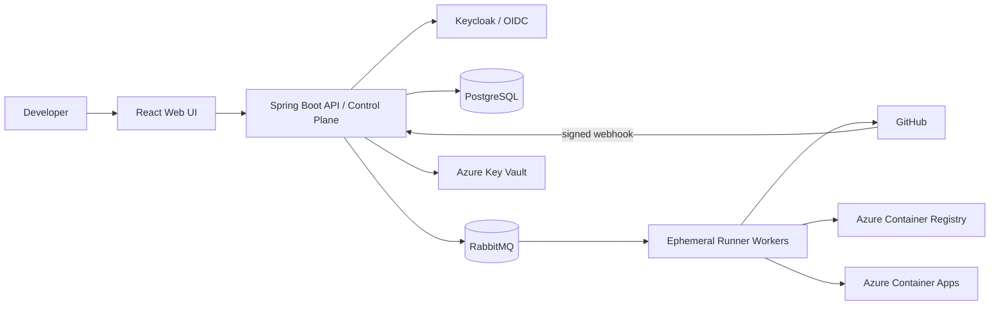

# Enterprise CI/CD Automation Platform

An educational, production-minded CI/CD orchestration platform. It connects a
Git repository, receives a verified source-control event, executes a versioned
pipeline, stores immutable artifacts, deploys the same artifact through
environments, and records every significant action.

The platform demonstrates how modern CI/CD systems are designed and
integrated. It is **not** a replacement for Jenkins, GitHub Actions,
GitLab CI, or Azure DevOps.

## Project purpose

Build an enterprise-oriented CI/CD orchestration platform covering the
mandatory MVP path:

```text
Developer push → GitHub webhook → webhook verification/idempotency → pipeline YAML validation
→ RabbitMQ → isolated worker → Maven build → unit tests → Docker image
→ Azure Container Registry push → Azure Container Apps deployment → dashboard status/logs
```

Every action must be attributable to a user, service, or webhook delivery.
Production approval and automated rollback are future scope (Phase 2), not MVP
requirements.

## High-level architecture

The platform separates a **control plane** (the web app and API that decide
what should happen) from a **data plane** (isolated workers that actually
build, test, and deploy). This prevents a repository build from having direct
access to the web application or database.



Key decisions:

- **Modular monolith** control plane (Spring Boot) rather than a microservice
  fleet; the **Worker is a separate service** because it executes untrusted
  code and scales independently.
- **RabbitMQ** provides a durable asynchronous job queue between the control
  plane and the workers.
- **PostgreSQL** is the source of truth for durable state; **Redis** is
  deferred unless measurements justify it.
- **Docker Compose** for local development and **Terraform** for Azure.

See `docs/adr/0001-modular-monolith-and-worker-boundary.md` for the rationale
behind these decisions and their trade-offs.

## Major components

| Component | Status | Responsibility |
|---|---|---|
| `frontend/` | Phase 0 (foundation) | React + TypeScript + Vite dashboard shell with health status display |
| `backend/` | Phase 0 (foundation) | Spring Boot control plane: health endpoint, PostgreSQL/RabbitMQ connectivity |
| `worker/` | Implemented (Phase 4 engine) | Consumes pipeline jobs from RabbitMQ, clones the repo, parses/validates the pipeline YAML, executes steps in a sandbox, publishes structured results |
| `pipeline-engine/` | Inside `worker/` for now | YAML DSL parser and validator (may move to a shared module later) |
| `infrastructure/` | Phase 0 (skeleton) | Terraform modules and environments for Azure |
| `scripts/` | Implemented | `publish-job.ps1` publishes a `PipelineJob` to RabbitMQ for local testing |

## Local development prerequisites

- **Java 21** (JDK) — to build and run the worker and backend on the JVM.
- **Maven 3.9+** — to build the worker and backend (`mvn -B verify`).
- **Node.js 20+** and **npm** — to build the React frontend.
- **Docker** with **Docker Compose** — for all services.
- **PowerShell** — `scripts/publish-job.ps1` requires Windows PowerShell 5.1+.

## Repository structure

```text
DevOps-CI-CD-Automation-Platform/
  frontend/                 # React TypeScript SPA (Phase 0 foundation)
  backend/                  # Spring Boot control plane (Phase 0 foundation)
  worker/                   # runner agent / execution adapter (implemented)
  pipeline-engine/          # DSL schema/parser (currently inside worker)
  infrastructure/           # Terraform modules and environments (Phase 0 skeleton)
  docs/                     # ADRs, module documentation, runbooks
  scripts/                  # safe developer automation
  tests/                    # e2e, load, fixtures (planned)
  .github/workflows/        # CI for this repository (planned)
  docker-compose.yml
  .env.example
  README.md
  PROJECT_SPECIFICATION.md
```

## How RabbitMQ and Worker interact

- **Exchanges:** `cicd.jobs.exchange` (direct) and `cicd.results.exchange` (direct).
- **Queues:** `cicd.jobs`, `cicd.jobs.delay` (TTL = retry delay, DLX → jobs
  exchange), `cicd.jobs.dlq`.
- **Routing keys:** `cicd.job.submitted`, `cicd.job.delay`, `cicd.job.dead`,
  `cicd.result`.

Flow:

```text
publish-job.ps1 / control plane  --cicd.job.submitted-->  cicd.jobs.exchange
      --> cicd.jobs queue  -->  worker (PipelineJobConsumer, manual ACK)
      --> clone + parse + validate + execute  -->  PipelineResult
      --> cicd.results.exchange (cicd.result)  -->  result queue / control plane
```

- The worker **acknowledges** a job only after a result was published or the
  message was routed to retry/DLQ (at-least-once delivery).
- Transient infrastructure failures are retried through the delay queue using
  the `x-retry-count` header, up to `worker.max-retries`.
- Malformed or permanently failing jobs are rejected to the dead-letter queue.
- `DuplicateJobGuard` prevents double execution of the same `jobId` within a
  worker process (in-memory dedup).

The RabbitMQ topology is declared by the worker itself
(`worker/.../config/RabbitMQConfig.java`) — do not duplicate it in
docker-compose, Terraform, or other tooling.

## Current implementation status

Implemented and verified:

- **Frontend** (Phase 0): React 18 + TypeScript + Vite SPA shell with backend
  health status display; Dockerfile with nginx reverse proxy.
- **Backend** (Phase 0): Spring Boot 3.3.5 control plane with:
  - Health endpoint (`GET /api/v1/health`) reporting database and RabbitMQ status
  - PostgreSQL connectivity via Spring Data JPA
  - RabbitMQ connectivity via Spring AMQP
  - Actuator health, structured logging, graceful shutdown
  - Unit and integration tests (H2 for test profile)
- **Worker** (Phase 4): Spring Boot 3.3.5 with:
  - RabbitMQ job consumption, retry/delay/DLQ, result publishing
  - JGit clone, SHA verification, detached checkout
  - Pipeline YAML parser, validator, loader
  - Step/job/stage/pipeline executors, artifact collector, duration watchdog
  - Process and Docker sandboxes, command security policy, env whitelisting
  - Prometheus metrics and health endpoints
  - Unit and integration tests (failsafe `*IT`)
- **Infrastructure**: Docker Compose stack (PostgreSQL, RabbitMQ, Redis,
  Keycloak, Backend, Frontend, Worker); Terraform skeleton for Azure.
- `scripts/publish-job.ps1` for submitting test jobs.

Not yet implemented (see roadmap below): GitHub webhook integration, pipeline
YAML execution, transactional outbox, Docker/ACR delivery, Azure Container
Apps deployment, full observability stack, and CI workflows.

## Future phases

See `PROJECT_SPECIFICATION.md` (§11.1) for the full roadmap.

| Phase | Objective |
|---|---|
| 0 | Foundation: monorepo, Docker Compose, PostgreSQL/RabbitMQ, Terraform skeleton |
| 1 | Access and projects: OIDC authentication, projects/repositories, basic RBAC, audit base |
| 2 | Source trigger: GitHub integration, HMAC verification, delivery idempotency |
| 3 | Pipeline definition: YAML schema/validation, persistence, manual trigger |
| 4 | Execution: orchestrator, RabbitMQ, isolated worker, state and logs (worker already implemented) |
| 5 | Delivery: Docker build, ACR push, artifact metadata, ACA deploy/status |
| 6 | Dashboard and hardening: history/log dashboard, error handling, observability, E2E tests |
| Phase 2 | Future scope: approvals, rollback, security gates, multi-tenancy hardening, GitLab/Bitbucket, AKS/Kafka |

## Local development (current state)

The full local stack is reproducible with a single command. See
`docs/local-development.md` for the complete guide (prerequisites, ports,
health checks, troubleshooting).

```bash
cp .env.example .env          # optional; defaults work without .env
docker compose up --build     # all services: frontend, backend, worker, infra
```

| Service | Local URL / port | Health check |
|---|---|---|
| Frontend | <http://localhost:3000> | nginx serves React SPA |
| Backend (Control Plane) | <http://localhost:8081/api/v1/health> | `/api/v1/health` |
| Worker | <http://localhost:8082/actuator/health> | `/actuator/health` via container healthcheck |
| RabbitMQ UI | <http://localhost:15672> | `rabbitmq-diagnostics ping` |
| PostgreSQL | `localhost:5432` | `pg_isready` |
| Redis | `localhost:6379` | `redis-cli ping` |
| Keycloak | <http://localhost:8081> | `/health/ready` on management port 9000 |

Tear down with:

```bash
docker compose down           # add -v to also remove named volumes
```

All credentials and ports come from environment variables with safe local
defaults (see `.env.example`). Credentials are never production secrets.

Submit a test job:

```powershell
.\scripts\publish-job.ps1 -RepoUrl <url> -CommitSha <sha> [-Branch main] [-PipelineFile pipeline.yml]
```

See `worker/README.md` for worker details and the pipeline YAML contract.
