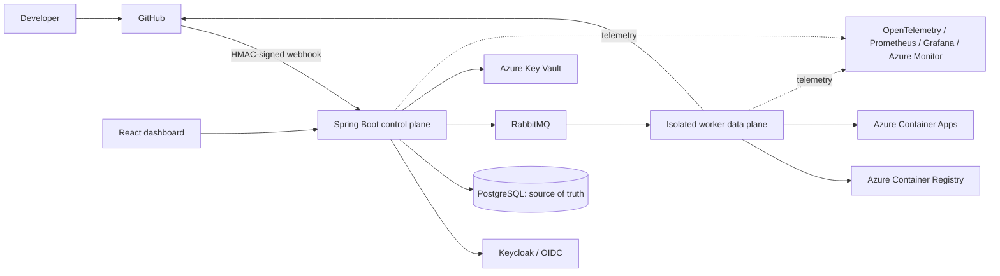
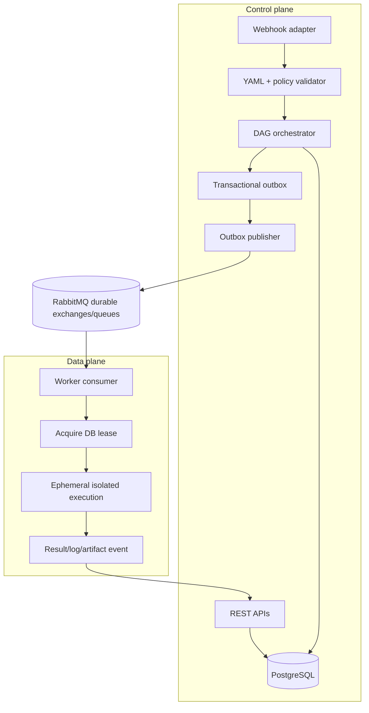
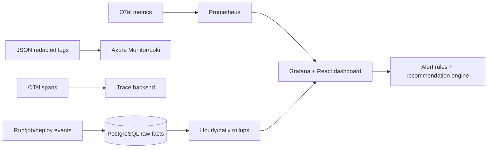
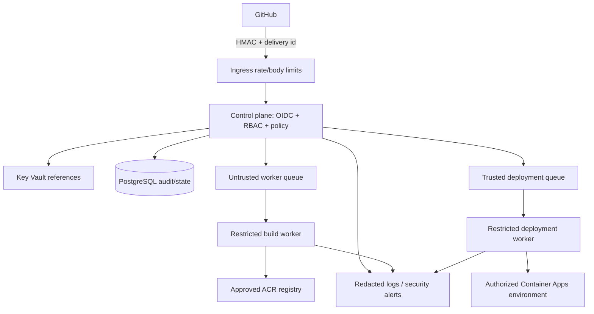
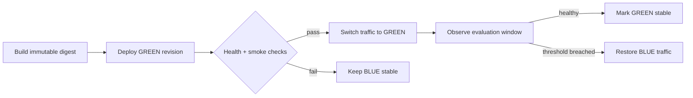
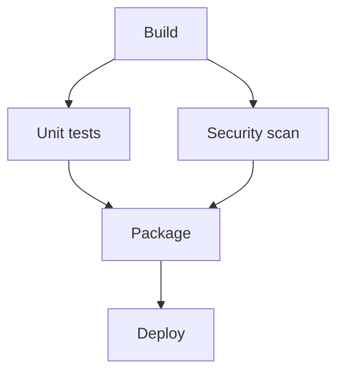
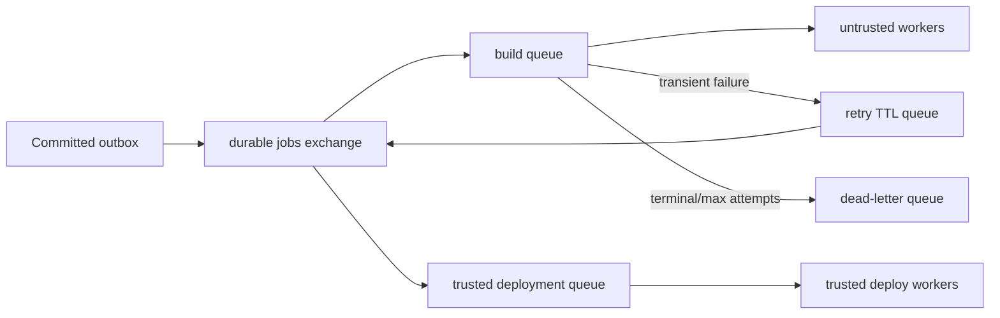
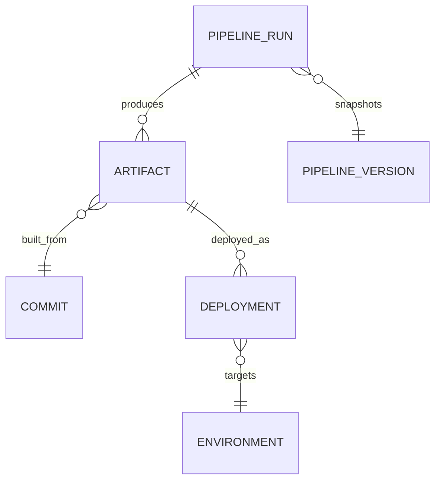
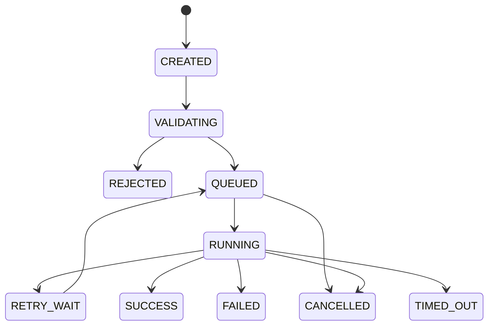
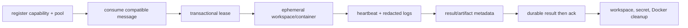

# CI/CD Pipeline Optimization and Engineering Guide

> **Status:** implementation blueprint  
> **Audience:** platform, backend, worker, cloud, security, and React engineers  
> **Scope:** our lightweight Azure-first CI/CD orchestration platform. This guide explains the architecture behind a CI/CD platform; it does not claim to replace Jenkins, GitHub Actions, GitLab CI, or Azure DevOps.

## 1. Purpose, boundaries, and decision principles

Our platform receives a signed GitHub event, validates a versioned pipeline, records durable state in PostgreSQL, schedules isolated workers through RabbitMQ, builds/tests/packages a pinned commit, publishes an immutable image to ACR, deploys to Azure Container Apps, and exposes the result in React.



**Optimization is a system property.** A short build that leaks secrets, loses jobs, or makes a bad deployment is not optimized. Every decision must improve, or explicitly preserve, speed, quality, security, reliability, scalability, cost, developer experience, observability, governance, and maintainability.

The governing principle is **Fast + Secure + Reliable + Observable + Cost Efficient**, not “fast at any cost.” PostgreSQL is authoritative for business state; RabbitMQ transports asynchronous work; Redis, if later introduced, is only a bounded cache, rate-limit counter, or distributed lock—not a source of truth.

### 1.1 Recommendation labels

| Label | Meaning |
|---|---|
| **Source-derived practice** | Widely established engineering practice implemented using platform-specific choices below. |
| **Architectural recommendation** | A design decision for this platform, selected for its current scope. |
| **Future / optional** | Useful only after the MVP is stable and measurements justify the operational complexity. |

### 1.2 Optimization delivery contract

Every optimization must be shipped behind a feature flag where it changes scheduling, retries, deployment, or security gates. Its implementation ticket must state the problem, owner, migration, API/YAML changes, telemetry, negative tests, rollout cohort, disabling/rollback action, and measurable acceptance criterion. No claimed improvement is valid until a baseline and repeated measurements exist.

## 2. Control plane, data plane, and end-to-end flow



| Area | Responsible component | Non-negotiable responsibility |
|---|---|---|
| Authentication, RBAC, project/pipeline management | control-plane API | never delegate authorization to YAML or a worker |
| Validation, DAG scheduling, durable state, audit | orchestrator module | transactional, auditable legal state transitions |
| Build/test/image execution | isolated worker | execute only a validated job envelope and restricted credentials |
| Delivery adapters | ACR/Container Apps adapter | deploy a recorded image digest, never `latest` |
| Read models, logs, recommendations | dashboard/analytics modules | explain failures without exposing secrets |

### End-to-end request flow

```mermaid
sequenceDiagram
  participant GH as GitHub
  participant API as Control plane
  participant DB as PostgreSQL
  participant MQ as RabbitMQ
  participant WK as Worker
  participant AZ as ACR/ACA
  GH->>API: signed delivery + delivery id
  API->>API: verify HMAC, timestamp, trigger, RBAC policy
  API->>DB: deduplicate event; snapshot YAML/commit; create run
  API->>DB: validate DAG, queue ready jobs + outbox atomically
  API->>MQ: publish after committed outbox
  WK->>DB: acquire lease for job attempt
  WK->>WK: checkout pinned SHA; run restricted steps
  WK->>AZ: push/deploy immutable digest when authorized
  WK->>DB: result, timings, artifact, audit event
  API->>MQ: schedule newly-ready dependents or cancel descendants
```

## 3. Metrics and measurement framework

All timestamps use UTC and a monotonic duration at the producing component. Metric labels are bounded: `project_id`, `pipeline_id`, `stage_type`, `job_type`, `outcome`, `environment`, and `attempt` are acceptable; never use raw commit SHA, user ID, log text, or arbitrary job name as a high-cardinality Prometheus label. Raw events and roll-ups remain in PostgreSQL/object storage; Prometheus stores operational aggregates.

### 3.1 Common metric contract

| Field | Requirement |
|---|---|
| Definition/formula | Define numerator, denominator, unit, exclusion rules, and window. |
| Data source | `pipeline_run`, `job_run`, worker heartbeat, queue management API, deployment adapter, billing export, or security finding. |
| Collection/storage | OTel metrics/traces and structured logs; durable raw values in PostgreSQL; long logs/artifacts in object storage. |
| Visualization | Overview trend plus project/run drill-down; show count and percentile, not only average. |
| Alert/target | Initial values are **example targets/TBD**, calibrated after baseline; alerts require sustained breach and a minimum sample count. |
| Caveat | Separate queue delay, tool time, retry time, and cancelled work; do not compare different commits or cache states as if equivalent. |

### 3.2 Metric catalog

| Group | Metric and formula | Source / visualization | Example alert or target (TBD until baseline) | Caveat |
|---|---|---|---|---|
| Pipeline performance | Total duration = terminal time − accepted time; stage/job/step duration = end − start | run/job timestamps; p50/p95 waterfall | p95 regression against rolling baseline | excludes time before webhook acceptance |
| Pipeline performance | Queue latency = worker-start − queued-at; startup latency = ready − worker-created | job/worker timestamps; queue/worker panel | sustained p95 above agreed SLO | distinguish no capacity from priority wait |
| Pipeline performance | Worker utilization = busy leased slots / allocatable slots | heartbeat + leases; heat map | sustained high utilization; threshold TBD | CPU utilization is not slot utilization |
| Pipeline performance | Build, test, Docker, push, deploy, health durations | worker step spans; run waterfall | stage p95 regression | cache hit/miss must be segmented |
| Quality | Pass/failure rate = passing/finished tests; flaky rate = tests with mixed outcomes / tests run | JUnit results; quality panel | failure spike vs baseline | retries can hide flakes; retain attempts |
| Quality | Defect escape = production defects linked to release / released changes; coverage; regression rate | issue integration/manual input + reports | trend only until data is mature | do not infer defects from pipeline failures |
| Delivery | Deployment frequency, success = successful/finished deploys, lead time = production deploy − commit time, change failure rate | deployment/run records; DORA panel | agreed per environment | manual approvals must be visible in lead time |
| Reliability | MTTD = incident detected − failure onset; MTTR = restored − detected; MTTF = operating time / failures | incident/deployment events; reliability panel | threshold agreed by service owner | meaningful only with consistent incident records |
| Infrastructure | CPU, memory, DB connections/utilization, queue depth, API latency/capacity | Azure Monitor, Prometheus, RabbitMQ; health panel | capacity alert uses sustained condition | use resource requests/limits context |
| Security | secrets/vulnerabilities/findings, failed gates, unauthorized attempts, policy violations | scanners/audit logs; security panel | critical finding or authz spike | scanner coverage/version affects trend |
| Cost | Cost/run = attributable period cost / runs; successful-deploy cost = cost/successes | Azure Cost export + usage allocation; cost panel | budget variance threshold TBD | label estimates and shared-cost allocation |
| Developer experience | Feedback time = first actionable result − webhook acceptance; recovery = successful retry/fix − failed run; config errors; wait time | run events/UI; DX panel | worsening percentile | surveys complement telemetry |

### 3.3 Instrumentation and dashboards

Every log, metric exemplar, and trace carries `pipeline_id`, `run_id`, `job_id` when applicable, `correlation_id`, `commit_sha` (logs/traces/database only), and `project_id`. Propagate W3C trace context in HTTP and RabbitMQ headers. Create these dashboards: pipeline overview; performance waterfall; worker/queue health; deployment health; security; cost; reliability; and optimization recommendations.



### 3.4 Security and deployment architecture views





## 4. Optimization catalogue

The following is the implementation standard for each optimization. Common APIs return `409` for legal-state/idempotency conflicts, `422` for invalid YAML/policy, `403` for authorization denial, and problem-details JSON with a stable code and correlation ID. All mutations require an authenticated actor or verified service identity and emit audit events.

### 4.1 Fail fast — MVP

**Problem / why:** invalid YAML, unavailable dependencies, denied permissions, compilation errors, and critical policy violations consume scarce workers and delay useful feedback. **Solution:** a control-plane preflight followed by ordered cheap worker gates: schema/action/dependency/permission validation → compile → unit tests → configured critical security gate → expensive packaging/deploy. A failed prerequisite marks dependent jobs `SKIPPED_UPSTREAM_FAILED`; it never dispatches them.

**Implementation:** `pipeline-validation` validates schema/version, allowed actions/images, dependency existence/cycles, branch/environment policy, resource bounds, secret references, and deployment authorization before creating executable jobs. `orchestrator` creates a run only after validation (or records `REJECTED` with errors for an explicit validation request). Workers stream step events and stop their process group on terminal gate failure. React renders the rejected field/path or first failed step and disabled downstream graph.

| Change | Design |
|---|---|
| Data | `pipeline_version.validation_status/errors`; `pipeline_run.failure_category`; `job_run.skip_reason`; index `(run_id,status)`. |
| APIs | `POST /pipelines/{id}/versions:validate`; `POST /pipeline-runs` returns validation errors or run ID; `GET /pipeline-runs/{id}` exposes blocking reason. |
| YAML | `failFast: true` default; gates can be configured only from approved action set. |
| Security | Validation is a security boundary; do not execute validation by shelling out to repository code. |
| Measure/test | avoided worker-minutes, rejected-before-worker rate, time-to-first-failure; malformed/cyclic/unauthorized YAML and downstream-cancellation tests. |
| Rollout/failure/rollback | dry-run validation telemetry → default enabled → enforce; if validator defect occurs, feature-flag enforcement off while retain audit and reject only clearly dangerous rules. |
| Acceptance | invalid or unauthorized pipelines consume zero worker slots; a prerequisite failure emits no descendant job message. |

### 4.2 Phased testing — SHOULD HAVE

**Problem / why:** expensive integration/E2E/performance tests run on code that cheap checks would already reject. **Solution:** declare ordered gates: (1) syntax/compile/unit/basic static, (2) integration/dependency/secret/SAST, (3) image/test-environment/E2E/accessibility/performance where applicable, (4) approval/production/post-deploy verification. Independent checks inside a phase can be parallel.

Persist each `test_suite_run`/result summary, report URI, and artifact checksum. The scheduler enables phase N+1 only after required phase-N jobs pass; a required failure cancels descendants, while optional findings record warnings according to policy. Artifacts are stored outside the database with immutable metadata in PostgreSQL.

| Change | Design |
|---|---|
| Modules/API/YAML | test-report adapter; `GET /runs/{id}/test-results`; YAML `phase`, `required`, `reports`, `artifacts`. |
| Security | Scanners use scoped credentials and their reports are access-controlled; do not expose source snippets/secrets in summaries. |
| Measure/test | feedback time, phase pass-through, compute avoided, flaky rate; verify required/optional propagation and report parsing failures. |
| Rollout/rollback | annotate phases first, enforce only Phase 1, then activate later gates per project; remove gate flag, not historical evidence. |
| Acceptance | an expensive required test cannot start after a required earlier phase fails. |

### 4.3 Dependency-aware parallel execution — SHOULD HAVE

**Problem / why:** stage-only sequential scheduling wastes time where jobs are independent. **Solution:** compile YAML to a directed acyclic graph (DAG); a job is ready when all required predecessors are `SUCCESS` (or explicitly permitted outcomes), its condition is true, it is within organization/project/run concurrency limits, and a worker pool is eligible.



**Scheduling algorithm:** transactionally lock candidate jobs with `FOR UPDATE SKIP LOCKED`; check dependency counters and quotas; change `CREATED` to `QUEUED`; insert outbox event; commit; publisher sends one durable message. On completion, update dependent counters and repeat. Reject cycles with topological sort at validation. Use weighted fair scheduling by organization/project, reserved deployment capacity, per-project caps, aging for starvation prevention, and a global safety cap.

| Change | Design |
|---|---|
| Data | `job_dependency(job_id,depends_on_job_id,required)` unique pair; `job_run(remaining_dependencies,priority,worker_pool)`; indexes on `(status,priority,queued_at)` and dependency parent. |
| APIs/UI | `GET /runs/{id}/dag`; `PATCH /projects/{id}/concurrency`; dashboard graph shows ready/running/blocked edge reason. |
| RabbitMQ/worker | queue by trust class/pool; worker only consumes compatible jobs; message is a hint and DB lease is authoritative. |
| Measure | critical-path duration, parallelism ratio = sum job durations / elapsed run duration, queue fairness, starvation age. |
| Test/rollback | DAG property tests, cycle/race/quota tests, load tests; feature flag falls back to validated sequential scheduler for new runs only. |
| Acceptance | independent jobs overlap when capacity exists; no job starts before required predecessors; no organization monopolizes the pool. |

**Illustrative performance model, not a benchmark:** sequential elapsed time is approximately `build + unit + scan + package + deploy`; parallel elapsed time is approximately `build + max(unit, scan) + package + deploy`, plus queue/worker overhead. Actual improvement is **TBD** and must be measured.

### 4.4 Caching — SHOULD HAVE

**Problem / why:** repeated dependency downloads and unchanged Docker layers waste network, time, and cost. **Solution:** cache Maven repository packages keyed by dependency manifests/tool version/OS-architecture; BuildKit layers keyed by Dockerfile, parent digest, relevant inputs and builder version; repository metadata with short TTL; artifact metadata in PostgreSQL. Test-result reuse is disabled by default; it is safe only when inputs, environment, and test semantics prove equivalence.

Safe candidates are public/package-manager dependencies validated by checksum, immutable base image layers, and non-secret metadata. Unsafe candidates include workspaces, `.git` credentials, Key Vault values, access tokens, unredacted logs, mutable `latest` images, and artifacts from another trust boundary.

| Control | Requirement |
|---|---|
| Isolation/key | Include org/project policy scope, dependency lockfiles, build tool and runner image versions; never let an untrusted project write a shared trusted cache. |
| Integrity | Verify checksums/signatures where available; cache metadata records producer, key/version, size, checksum, expiry, and trust class. |
| Invalidation | Change key on manifest/tool/base-image changes; explicit purge; quarantine on corruption; TTL/LRU size limit. |
| Redis | Use only for short-lived metadata/rate limiting if database measurements prove need. Use blob storage/BuildKit cache for bytes and PostgreSQL for truth. |
| Measure/test | hit ratio, download time, cache restore/save time, corruption/quarantine count; verify cross-project denial and corrupted-cache rebuild. |
| Rollout/rollback | read-only cache pilot → writes for untrusted pool → broader scope; disable reads/writes with flag and purge only a validated key namespace. |

### 4.5 Docker build optimization — SHOULD HAVE

Use BuildKit, multi-stage builds, pinned minimal base images, a restrictive `.dockerignore`, and immutable tags plus recorded digest. Copy dependency descriptors before source so unchanged dependencies retain layers.

```dockerfile
# syntax=docker/dockerfile:1
FROM maven:3.9-eclipse-temurin-21 AS build
WORKDIR /src
COPY pom.xml .
RUN --mount=type=cache,target=/root/.m2 mvn -B dependency:go-offline
COPY src ./src
RUN --mount=type=cache,target=/root/.m2 mvn -B package -DskipTests

FROM eclipse-temurin:21-jre
WORKDIR /app
COPY --from=build /src/target/*.jar app.jar
USER 10001
ENTRYPOINT ["java","-jar","/app/app.jar"]
```

Never put build secrets in `ARG`, layers, image history, or cache exports. Generate `image_tag=<commit-sha>` and persist ACR's returned `image_digest`; deployment consumes the digest. Measure Docker duration segmented by cache hit/miss, context size, layers reused, image size, push time, and reproducibility (same inputs → same declared output metadata). Test `.dockerignore`, secret absence, digest deployment, cache poisoning, and failed push compensation. Roll back by disabling remote cache / using a known builder version; never replace a recorded digest.

### 4.6 Intelligent retries — SHOULD HAVE

Only retry **transient** outcomes: bounded network timeout, temporary Azure/RabbitMQ endpoint failure, or retryable HTTP status identified by adapter policy. Do not automatically retry compilation/test/YAML/configuration/policy failure. Each attempt has an idempotency key `(job_run_id, attempt)` and deployment adapter idempotency key based on run/job/digest/environment.

Backoff is `min(cap, base * 2^(attempt-1)) + random(0,jitter)`; values are configuration, not hard-coded. After max attempts, write terminal failure and route the original message to a DLQ with reason/attempt metadata. A reconciler compares leases, queue state, and job state; it never blindly duplicates a deployment.

| Change | Design |
|---|---|
| Data | `job_attempt`, `retry_policy`, `next_attempt_at`, `failure_class`, `idempotency_key`; unique active attempt; audit classification decision. |
| Queue/worker | manual ack only after durable result; delayed retry queue/TTL + DLX; lease heartbeat; duplicate message checks DB state. |
| API/YAML | retry policy schema limits max attempts and allowlisted retry classes; `POST /jobs/{id}:retry` requires permission and records actor. |
| Test/acceptance | fault inject timeout/duplicate/crash; permanent failures create one attempt; transient failures back off and never cause multiple active deployments. |
| Rollback | set retry policy to zero for new attempts and drain via reconciler; do not discard DLQ evidence. |

### 4.7 RabbitMQ and queue optimization — MVP durable baseline; tuning SHOULD HAVE

Use durable topic exchange, durable queues, persistent messages, publisher confirms, consumer acknowledgements, bounded prefetch matching worker slot count, TTL retry queues, DLQs, and queue-per-trust-class/pool. Priority is limited to a small range and cannot bypass fairness indefinitely. Queue latency is `job_run.worker_started_at - job_run.queued_at`; publish-to-consume is separately measured from broker headers.



When depth rises, enforce admission/concurrency caps, scale eligible workers, and surface estimated wait. If workers lack capacity, retain jobs durably rather than accepting unlimited work. If a worker fails, lease expiry plus reconciliation requeues only idempotent unfinished jobs. If RabbitMQ is unavailable, the outbox retains committed work; API returns accepted/queued-pending-publish, alerts operators, and never marks work started. Use job timeout, worker lease, heartbeat, and stale recovery together.

### 4.8 Dynamic worker scaling — Phase 2

Separate untrusted build/test workers from trusted deployment workers. Scale a pool from queue depth per eligible slot, oldest queue age, and active lease utilization—not CPU alone. Configure minimum/maximum replicas, distinct scale-out/scale-in thresholds, cooldown, startup latency budget, burst cap, and cost ceiling. Azure Container Apps Jobs/KEDA may implement this when the MVP evidence shows a static pool is insufficient.

Scale out gradually when sustained backlog or oldest-age threshold is breached; scale in only after quiet period and no leases. Draining workers stop acquiring jobs, finish/cancel safely by deadline, clean workspace/secrets, relinquish lease, then terminate. Measure queue p95, startup p95, utilization, cost/run, and job interruption rate. Roll back autoscaling by pinning a tested fixed replica count; retain workload caps.

### 4.9 DevSecOps — MVP foundation, scanners phased

MVP: verify GitHub HMAC with Key Vault secret and replay window; OIDC/JWT validation and server-side RBAC; least-privilege managed identities; secret masking; action/image allowlists; isolated workers; CPU/memory/PID/time limits; egress/network restrictions; immutable artifacts; and append-only audit events. Add Gitleaks, Trivy, dependency scan, SonarQube/SAST, Checkov, and OWASP Dependency-Check one at a time as adapter-backed Phase 2/optional gates after measuring false-positive handling and execution cost.

Security gates reduce costly late failures and incident recovery; they are not merely compliance work. Critical policy failures fail fast. Findings include scanner/version/rule/severity/location fingerprint/status, not raw secret values. Test webhook replay, missing RBAC, forbidden action/image, malicious log output, egress denial, resource exhaustion, and unauthorized deployment.

### 4.10 Pipeline YAML security — MVP

YAML is untrusted input and must be schema-validated, versioned, size-limited, parsed safely (no arbitrary object deserialization), and compiled into a restricted internal job model. It must never be a generic shell/privileged container orchestration API.

```yaml
pipeline:
  name: ecommerce-api
  version: "1"
  failFast: true
triggers:
  github: { branches: [main] }
resources: { cpu: "1", memory: "2Gi", timeoutSeconds: 1800 }
stages:
  - name: build
    jobs:
      - name: compile
        action: maven
        arguments: ["-B", "clean", "package", "-DskipTests"]
  - name: quality
    jobs:
      - name: unit-tests
        action: maven
        arguments: ["-B", "test"]
        dependsOn: [compile]
      - name: dependency-scan
        action: dependency-scan
        dependsOn: [compile]
  - name: deploy-dev
    environment: development
    jobs:
      - name: deploy
        action: aca-deploy
        dependsOn: [unit-tests, dependency-scan]
        image: "${artifact.imageDigest}"
```

Reject examples: `action: shell` with arbitrary host commands; `privileged: true`; Docker socket/host-path mounts; `hostNetwork: true`; image not in approved registry; production deployment from an unprotected branch; inline `password:`/token; resource or timeout above quota; unknown schema version; missing dependency; cycle. The validator reports JSON pointer/path, policy code, and safe remediation. It resolves secret **references** only after authorization and does not include values in validation output.

### 4.11 Secrets — MVP

PostgreSQL stores a Key Vault URI/reference, purpose, rotation metadata, and access audit pointer—never a raw secret. API and worker identities use managed identity; a worker receives a short-lived, job-scoped reference/token only for approved secret names and only at execution time. It may access registry/deployment credentials necessary for its assigned pool; it must never receive database owner credentials, global Key Vault read access, control-plane signing keys, other project secrets, or broad Azure subscription credentials.

Redactor registers resolved values and encoded variants before logs are persisted; reject logging commands that print environments where practical. Rotate by updating Key Vault version/reference policy, testing a canary run, revoking old access/version per retention policy, and auditing each access. Failure to retrieve a required secret is a safe terminal/pre-execution failure, not a reason to print diagnostics containing it.

### 4.12 Immutable artifacts — MVP

The chain is `commit SHA → immutable pipeline version/run → artifact → ACR image digest → deployment`. Tags such as `project:<short-sha>` aid discovery, but the deployment contract uses `registry/repository@sha256:...`. Store provenance (commit, pipeline version, builder image/tool versions, timestamps, checksums), support promotion of the same digest, and retain the previous stable digest per environment.



Test digest mismatch, mutable-tag attack, duplicate artifact event, and deployment traceability. Rollback deploys the recorded earlier stable digest—not a rebuilt image—and records a new deployment event.

### 4.13 Blue-green deployment — Phase 2

Deploy candidate **GREEN** beside stable **BLUE**, health/smoke-test GREEN, switch Azure Container Apps traffic/revision weights, monitor, then promote or restore BLUE. Model deployment revision, traffic weight, checkpoint, health evidence, approval, and actor. APIs: `POST /deployments/{id}:promote`, `:rollback`, `GET /environments/{id}/revisions`; UI shows active/candidate/traffic. Start with manual approval and a non-production environment. A failed health check keeps traffic on BLUE; traffic switch failure triggers idempotent restore. Do not claim database rollback: use expand-and-contract migrations, backward-compatible app versions, and separately approved data repairs.

### 4.14 Automated rollback — Phase 2

Checkpoint before traffic change and trigger a rollback workflow on deployment/health/smoke failure, crash-loop, or agreed post-deploy error-rate threshold. Guard against flapping with evaluation windows, one rollback per deployment, manual override, and idempotent revision API calls. Never automatically reverse destructive database schema/data migrations. Measure time-to-restore and false rollback rate; test an injected unhealthy revision and a failed traffic restore. Feature flag starts in observe-only mode, then manual, then narrowly automated.

### 4.15 Terraform / IaC — MVP base

Terraform defines resource groups, ACR, PostgreSQL, Key Vault, Container Apps/environment, monitoring, networking, managed identities, and role assignments. Pipeline: `fmt → validate → security scan when adopted → plan → protected approval → apply`. Use separate dev/staging/production state and credentials, remote encrypted state with locking, restricted read access, and no secrets in state where avoidable. Drift detection runs plan on schedule and creates an auditable finding; it never auto-applies production corrections. Test plan policy violations, identity permissions, and recreate-from-code in dev. Roll back infrastructure through reviewed compensating Terraform changes, not state deletion.

### 4.16 Bottleneck analysis and recommendations — Phase 2 after telemetry

For each terminal run calculate `stage_share = stage_duration / total_pipeline_duration * 100`, separated into queue, startup, execution, retry, and cancellation time. The largest stable p95 share is the current bottleneck, but label low-sample findings as inconclusive.

The deterministic recommendation engine evaluates versioned rules, evidence window, confidence/sample count, recommendation text, status, and suppression reason. Examples: Docker p95 regression with low layer hit ratio → layer-cache advice; high queue p95 plus high slot utilization → scale/concurrency review; independent sequential DAG nodes → parallelism; dependency-download share high → Maven cache; recurring stage failure → investigation. It is **not AI-powered**. Show evidence and link to runs; users can dismiss/snooze. Rule changes are feature-flagged and tested with fixtures.

### 4.17 Cost and developer experience — MVP visibility; advanced allocation Phase 2

Use short-lived workers, resource limits, image/log/artifact retention, image cleanup, scale-to-zero only where startup latency permits, and Azure budget alerts. Allocate cost cautiously: direct worker duration × rate plus project-attributable storage/registry usage; show shared platform cost separately. Compute `cost/run`, `cost/successful deployment`, and `cost/project` with allocation version and “estimated” label.

The dashboard gives a developer pipeline state, current stage, failed step/reason, redacted live/tail logs, duration, permitted retry, commit SHA, artifact digest, deployment result, historical run comparison, and actionable error code. Success is reduced time to first actionable feedback and recovery, not merely a prettier screen.

## 5. Data model, state, and reliability

### 5.1 Core entities

| Entity | Purpose / key fields | Constraints and indexes |
|---|---|---|
| Organization, User, Role | tenancy and Keycloak identity mapping | unique external subject; membership unique `(org,user,role)` |
| Project, Repository | ownership, GitHub connection, policy | unique project slug/org; repo provider ID unique; indexes org/project |
| Pipeline, PipelineVersion | logical pipeline and immutable YAML snapshot/schema/validation | unique `(pipeline,version)`; checksum immutable after published |
| PipelineStage, PipelineJob, PipelineStep | normalized compiled definition/action/config | ordered stage/job; allowed action validated |
| JobDependency | DAG edges | unique `(job,depends_on)`; no self edge; indexed both directions |
| PipelineRun, StageRun, JobRun, JobAttempt | execution snapshot, state, timing, failure/retry | idempotency unique `(repo,provider_delivery)` / trigger key; index active states, project/time |
| Artifact, Deployment | digest/provenance and environment/revision/health | artifact digest unique per registry; deployment idempotency unique `(environment,digest,operation)` |
| WebhookEvent, OutboxEvent, AuditLog | receipt/dedup, reliable publication, append-only evidence | delivery ID unique/provider; outbox status index; audit append-only indexed actor/entity/time |
| Worker, WorkerLease | eligibility, capability, heartbeat, active ownership | active lease unique job attempt; heartbeat/expiry indexes |
| PipelineMetric, SecurityFinding, OptimizationRecommendation | raw/rolled metrics, evidence, actionable rules | time/project indexes; finding fingerprint uniqueness; recommendation rule/window uniqueness |

Add `created_at`, `updated_at`, actor/correlation IDs, optimistic `version` where concurrent changes matter, and tenant/project scope to every relevant entity. PostgreSQL constraints enforce what application checks alone cannot.

### 5.2 State machine and outbox



Transitions are transactional, guarded by current state/version, and audited. `SUCCESS`, `FAILED`, `CANCELLED`, `TIMED_OUT`, and `REJECTED` are terminal. Worker lease expiry does not itself mean failure: reconciliation verifies durable result, attempts safe recovery, then transitions with an explicit reason. The outbox row is committed in the same transaction as `QUEUED`; publisher confirms before marking it sent. Consumers are at-least-once, so handlers must be idempotent.

## 6. REST API outline

| Method / endpoint | Purpose, authorization, idempotency |
|---|---|
| `GET /me`, `GET /organizations/{id}/members` | authenticated identity/membership; admin for membership reads |
| `POST/GET/PATCH /projects` | organization/project role required; validate quota and tenant scope |
| `POST/GET/PATCH /repositories` | project admin; provider metadata only, secret reference separately managed |
| `POST /pipelines`, `POST /pipelines/{id}/versions` | developer/admin; YAML schema/policy validation, immutable published version |
| `POST /pipelines/{id}/versions:validate` | developer; no execution; returns path/code/message |
| `POST /pipeline-runs`, `GET /pipeline-runs/{id}` | trigger/read permitted role; `Idempotency-Key` for manual trigger |
| `POST /pipeline-runs/{id}:cancel`, `POST /jobs/{id}:retry` | authorized initiator/admin; legal-state and idempotency checks |
| `GET /pipeline-runs/{id}/dag`, `/logs`, `/test-results`, `/artifacts` | scoped viewer; logs redacted and paginated/streamed |
| `GET /deployments`, `POST /deployments/{id}:promote|rollback` | environment-specific deploy/approve role; Phase 2 endpoints guarded by flag |
| `POST /webhooks/github` | public only for GitHub; HMAC, timestamp, delivery dedup, rate/body limits |
| `GET /metrics/*`, `/workers`, `/security-findings`, `/optimization-recommendations` | scoped viewer/security/admin roles; aggregates only where appropriate |

Responses use resource representations with stable IDs, timestamps, status, links, and correlation ID. Cursor paginate history/logs. Request validation rejects unknown dangerous YAML fields; errors use RFC 9457-style problem details (`code`, `detail`, safe `field`, `correlationId`).

### 6.1 Representative contracts

```http
POST /api/v1/pipelines/pipe_123/versions:validate
Authorization: Bearer <JWT>
Content-Type: application/yaml

pipeline:
  name: ecommerce-api
  version: "1"
  stages: []
```

```json
{
  "valid": false,
  "errors": [{"path":"/stages/0/jobs/0/image","code":"IMAGE_NOT_ALLOWED","detail":"Image is not from an approved registry."}],
  "correlationId":"cor_..."
}
```

```http
POST /api/v1/pipeline-runs
Authorization: Bearer <JWT>
Idempotency-Key: 5e2f...
Content-Type: application/json

{"pipelineVersionId":"pv_123","commitSha":"<40-hex-sha>","trigger":"MANUAL"}
```

```json
{"id":"run_123","status":"QUEUED","commitSha":"<40-hex-sha>","dagUrl":"/api/v1/pipeline-runs/run_123/dag"}
```

Webhook requests are accepted only after raw-body HMAC verification; a duplicate delivery returns the original accepted outcome instead of another run. State-changing requests validate tenant scope, actor permission, legal state, resource quotas, and idempotency. Every endpoint in the outline has a generated OpenAPI contract with request/response examples, error codes, authorization matrix, and contract tests before release.

## 7. Worker architecture



Workers authenticate with workload identity, register capabilities and version, acquire a short renewable lease, checkout the exact commit SHA, execute only validated action adapters inside a restricted ephemeral workspace, stream redacted logs, persist result, acknowledge, then delete workspace/secrets/temp credentials and safe Docker state. Cancellation terminates the process group, records a terminal result, and cleans up. Workers have non-root execution, CPU/memory/PID/disk/time limits, no host mounts/docker socket, restricted egress, and distinct trusted deployment pool credentials. A heartbeat failure causes reconciliation after grace period.

## 8. Threat model

| Threat | Risk | Mitigation / detection / response | Residual risk |
|---|---|---|---|
| Malicious/replayed/duplicate webhook | unauthorized or duplicate run | HMAC over raw body, timestamp window, delivery-ID uniqueness, rate limit; audit/reject/alert | provider secret compromise |
| Malicious YAML/repository code | host compromise, crypto-mining | strict DSL/allowlists, isolated limits/egress, no host mounts; policy denial and worker anomaly alerts | sandbox escape zero-day |
| Secret exfiltration/log leakage | credential compromise | Key Vault scoped identity, masking, no raw DB fields, egress controls; revoke/rotate/investigate | secrets can be used by legitimate process |
| Compromised worker/privilege escalation | control-plane/cloud impact | separate pools, minimal identity, immutable runner image, patching; quarantine worker/revoke identity | trusted deployment pool is high value |
| Poisoned image/dependency/artifact | supply-chain compromise | pinned digests/checksums, approved registries, scanner adapters; quarantine/rebuild/revoke digest | scanner coverage incomplete |
| Unauthorized deployment | production outage | environment RBAC/protection/approval, immutable digest/audit; stop traffic/rollback | authorized human error |
| Queue/DB outage or message duplication | lost/duplicate work | outbox, durable queues, DB leases/idempotency, backups; reconcile/fail safe | regional dependency outage |
| Log injection / credential leakage | misleading UI/data exposure | structured logs, escaping/redaction, content security policy; quarantine/rotate | attacker-controlled logs still consume storage |

## 9. Testing and benchmarking

Test unit state transitions, parser/schema/allowlists, retry classifier and scheduler; integration with Testcontainers for PostgreSQL/RabbitMQ; API/authz/contract tests; DAG property/race tests; worker isolation/cleanup tests; RabbitMQ failure tests; secret redaction; Terraform validation/plan policy tests; k6 webhook/dashboard load tests; and end-to-end pinned-commit build→test→image→ACR→ACA in an isolated environment.

Inject GitHub, RabbitMQ, PostgreSQL, worker, Docker, ACR, Azure deployment, duplicate-webhook, timeout, invalid/malicious YAML, and secret-exposure failures. Acceptance requires safe terminal state, audit evidence, no secret in persisted logs, and a documented operator action.

Baseline is sequential execution, no cache, fixed worker count. Optimized configuration enables only the chosen feature set. Hold commit, command, runner image, region, capacity, cache state, and sample size explicit. Run repeatedly, retain raw data, report average and p95; do not fabricate results.

| Metric | Baseline | Optimized | Improvement |
|---|---:|---:|---:|
| Pipeline duration | TBD | TBD | TBD |
| Queue latency | TBD | TBD | TBD |
| Build duration | TBD | TBD | TBD |
| Test duration | TBD | TBD | TBD |
| Docker build duration | TBD | TBD | TBD |
| Deployment duration | TBD | TBD | TBD |
| Cost/run | TBD | TBD | TBD |
| Success rate | TBD | TBD | TBD |

## 10. Roadmap, MVP boundary, governance, and alerting

| Phase | Goal / deliverables / acceptance |
|---|---|
| 0 Foundation | modular monolith, compose/Terraform skeleton, PostgreSQL/RabbitMQ; local stack persists a run |
| 1 Auth + RBAC | Keycloak/OIDC, scoped projects and audit; unauthorized access denied |
| 2 GitHub | HMAC, replay/delivery dedup, repository triggers; one delivery creates one run |
| 3 YAML engine | schema/policy/DAG validation; invalid input uses zero worker capacity |
| 4 Execution | outbox, queue, lease/heartbeat worker; crash recovers safely |
| 5 Build/test/Docker | Maven/JUnit, logs, image digest; pinned commit produces traceable artifact |
| 6 Azure delivery | ACR + ACA + Key Vault; deployed digest/status visible |
| 7 Security hardening | isolation, limits, allowlists, audit; negative threat tests pass |
| 8 Observability | OTel metrics/logs/traces, dashboards/alerts; run drill-down works |
| 9 Optimization | phased tests, DAG concurrency, cache/retries, deterministic recommendations; benchmark evidence retained |
| 10 Advanced delivery | blue-green, rollback, autoscale, advanced scanners; only after prior reliability criteria |

**Must have:** signed GitHub webhook, auth/RBAC, YAML validation, PostgreSQL, RabbitMQ, isolated worker, Maven/JUnit, Docker, ACR, Container Apps, Key Vault, basic telemetry/metrics. **Should have:** parallel DAG, phased testing, bounded retries, caching, selected security gates, performance dashboard. **Phase 2:** blue-green/automatic rollback, advanced scanners, autoscaling optimization, advanced recommendations, multi-cloud/advanced strategies.

Govern pipeline versions, approval/environment protections, deploy roles, audit/retention policies, secret rotation/access review, resource/concurrency quotas, and exception expiry. Alerts: INFO for noteworthy trends; WARNING for sustained queue/latency/utilization/failure/cost degradation; CRITICAL for secret detection, unauthorized execution, persistent RabbitMQ/DB/Azure failure, high deployment failure, or agreed SLO breach. Alerts link to dashboard/runbook and must be tuned from baseline to avoid noise.

## 11. Dashboard and final scorecard

React pages: Overview, Projects, Pipelines, Pipeline Run/DAG, Logs, Artifacts, Deployments, Security, Workers, Metrics, Optimization, and Audit. Optimization view shows average/p95 duration, queue latency, success/test pass rate, deployment frequency/success, MTTD/MTTR, utilization, estimated cost/run, bottlenecks, evidence-backed recommendations, and comparison between selected runs. All views honor organization/project/environment RBAC and redact secrets.

### Before and after

| Before | After / why |
|---|---|
| GitHub → serial build → test → security → Docker → deploy | GitHub → preflight validation → parallel eligible quality gates → safe caches → security gate → optimized Docker → immutable digest → protected deployment → health verification → rollback capability. |
| Failures consume downstream work | prerequisite failure skips descendants and returns earlier actionable feedback. |
| Mutable tags and unclear provenance | commit/run/artifact/digest/deployment lineage enables audit and safe rollback. |
| Queue work is opaque | leases, heartbeats, DLQ, metrics, and reconciliation expose and recover failures. |

| Area | Current state | Optimization | Metric | Target | Status |
|---|---|---|---|---|---|
| Speed | TBD baseline | DAG + cache + fail fast | p95 pipeline duration | TBD after benchmark | Planned |
| Quality | TBD baseline | phased required gates | test pass/flaky rate | TBD | Planned |
| Security | MVP controls | allowlists/gates | critical findings/authz attempts | zero accepted critical violations | In progress |
| Reliability | durable queue/state | retry/reconcile/lease | MTTR, failed/lost jobs | TBD | Planned |
| Cost | TBD allocation | limits/retention/scaling | cost/run | TBD | Planned |
| Developer UX | TBD baseline | actionable dashboard | feedback/recovery time | TBD | Planned |

## 12. Implementation checklist

- [ ] Add immutable pipeline snapshots, job dependencies, attempts, leases, outbox, metrics, finding, and recommendation migrations with indexes/constraints.
- [ ] Implement schema/policy validator and DAG compiler before worker dispatch.
- [ ] Implement transactional scheduler/outbox, idempotent consumer, bounded retry/DLQ, heartbeat reconciler.
- [ ] Harden worker pools, Key Vault references, log redaction, action/image restrictions, resource and network limits.
- [ ] Add OTel context propagation and the metric catalog; establish baseline dashboards before tuning.
- [ ] Add Maven/BuildKit caches only with isolation, checksum, purge, and hit/miss evidence.
- [ ] Ship DAG/retry/cache/rollback features via flags with a documented disable path.
- [ ] Complete fault injection, load, E2E, and benchmark templates; replace no `TBD` values until measured.

This guide deliberately favors a reliable MVP over an impressive-but-fragile feature list. Add technology only when a specific bottleneck, security requirement, or operational need is measured and owned.
