# Module 1 — PostgreSQL Domain Model & Control-Plane Persistence Layer

**DevOps CI/CD Automation Platform — Control Plane**

| Attribute | Value |
|-----------|-------|
| Module | 1 |
| Name | PostgreSQL Domain Model & Control-Plane Persistence Layer |
| Base Package | `com.cicd.platform.controlplane` |
| Repository Root | `backend/` |
| Java | 21 |
| Spring Boot | 3.3.5 |
| ORM | Spring Data JPA / Hibernate |
| Production DB | PostgreSQL |
| Test DB | H2 (in-memory) |
| Migrations | Flyway |
| Build | Maven |
| Tests | JUnit 5 |

---

## Table of Contents

1. [Executive Summary](#1-executive-summary)
2. [Module Objectives](#2-module-objectives)
3. [Scope](#3-scope)
4. [Architecture Overview](#4-architecture-overview)
5. [Domain Model Overview](#5-domain-model-overview)
6. [Domain Relationship Model](#6-domain-relationship-model)
7. [Entity-by-Entity Documentation](#7-entity-by-entity-documentation)
8. [Database Schema](#8-database-schema)
9. [Flyway Database Migration](#9-flyway-database-migration)
10. [JPA / Hibernate Mapping Strategy](#10-jpa--hibernate-mapping-strategy)
11. [Repository Layer](#11-repository-layer)
12. [Service Layer](#12-service-layer)
13. [REST API Layer](#13-rest-api-layer)
14. [DTO Architecture](#14-dto-architecture)
15. [Exception Handling](#15-exception-handling)
16. [Data Integrity](#16-data-integrity)
17. [Testing Architecture](#17-testing-architecture)
18. [H2 vs PostgreSQL](#18-h2-vs-postgresql)
19. [Transaction and Flush Behavior](#19-transaction-and-flush-behavior)
20. [Configuration](#20-configuration)
21. [Build and Verification](#21-build-and-verification)
22. [Production Readiness Assessment](#22-production-readiness-assessment)
23. [Security Considerations](#23-security-considerations)
24. [Observability and Auditability](#24-observability-and-auditability)
25. [Enterprise Design Decisions](#25-enterprise-design-decisions)
26. [Failure Analysis / Engineering Lessons](#26-failure-analysis--engineering-lessons)
27. [End-to-End Request Flow](#27-end-to-end-request-flow)
28. [Database Lifecycle](#28-database-lifecycle)
29. [Module Dependencies](#29-module-dependencies)
30. [What Module 1 Enables](#30-what-module-1-enables)
31. [Next Module](#31-next-module)

---

## 1. Executive Summary

Module 1 establishes the **persistence foundation** for an enterprise CI/CD automation platform. It provides a complete relational domain model mapping fourteen core business concepts — organizations, projects, repositories, pipelines, pipeline versions, pipeline runs, stages, jobs, attempts, webhook events, outbox events, artifacts, deployments, and audit events — to a PostgreSQL database through JPA/Hibernate, with Flyway-managed schema migrations and a comprehensive test suite validated against an isolated H2 database.

A CI/CD control plane requires a persistent domain model because pipeline orchestration, build tracking, deployment recording, and audit compliance all depend on reliable, consistent, and queryable state. Without a stable persistence layer, higher-level capabilities such as pipeline execution scheduling, worker coordination, and deployment tracking cannot function correctly.

Module 1 intentionally implements **only the persistence and CRUD foundation**. It does not implement pipeline execution, worker orchestration, RabbitMQ messaging, webhook processing, authentication, authorization, Docker builds, Azure deployment, or CI/CD optimization. These capabilities are deferred to future modules that will build on top of the domain model established here.

---

## 2. Module Objectives

| # | Objective | Architectural Rationale |
|---|-----------|------------------------|
| 1 | Establish the core enterprise domain model | Provides the shared vocabulary and data structures that all future modules reference |
| 2 | Persist CI/CD platform state to PostgreSQL | Ensures platform state survives application restarts and supports concurrent access |
| 3 | Define relationships between organizational, project, pipeline, and execution entities | Enforces referential integrity and supports hierarchical queries |
| 4 | Provide Spring Data JPA repository abstractions | Eliminates boilerplate data-access code while preserving full query control |
| 5 | Provide CRUD services for core resources | Encapsulates business rules and validation at the domain boundary |
| 6 | Expose REST controllers for core resources | Provides an HTTP API contract for external consumers and future UI modules |
| 7 | Establish database migrations through Flyway | Ensures schema changes are version-controlled, repeatable, and audit-safe |
| 8 | Support production PostgreSQL | Targets the enterprise-grade relational database required for production workloads |
| 9 | Support isolated H2 integration testing | Enables fast, deterministic test execution without external infrastructure |
| 10 | Enforce database-level constraints | Provides a final safety net for data integrity beyond application-level validation |
| 11 | Provide a foundation for future orchestration modules | Ensures future modules can build on stable, tested persistence contracts |

---

## 3. Scope

### In Scope

- 14 JPA entity classes mapping to 14 PostgreSQL tables
- 1 Flyway migration (`V1__create_domain_schema.sql`) creating all tables, indexes, constraints, and check constraints
- 14 Spring Data JPA repository interfaces with custom query methods
- 4 service classes (OrganizationService, ProjectService, RepositoryService, PipelineService) with business-rule validation
- 4 REST controllers exposing CRUD endpoints under `/api/v1/`
- 10 DTOs (5 request, 4 response, 1 error) using Java records
- Global exception handler mapping domain exceptions to HTTP status codes
- Production configuration (PostgreSQL, Flyway enabled, `ddl-auto=validate`)
- Test configuration (H2, Flyway disabled, `ddl-auto=create-drop`)
- 4 service unit tests (Mockito-based)
- 2 integration test suites (MockMvc-based CRUD tests, repository-level constraint tests)
- 1 application context smoke test
- 1 health endpoint test
- Health check endpoint verifying database and RabbitMQ connectivity

### Out of Scope

- **Authentication / Authorization** — No login, JWT, OAuth, RBAC, or session management is implemented
- **Webhook processing** — `webhook_events` records incoming events but no processing logic executes them
- **Pipeline orchestration** — `pipeline_runs`, `pipeline_stages`, `pipeline_jobs` record state but no orchestration engine drives execution
- **Worker execution** — `pipeline_jobs.worker_id` is a placeholder; no worker pool, container execution, or job runner exists
- **RabbitMQ publishing** — `outbox_events` records events but no publisher polls or sends messages
- **Docker builds** — No Dockerfile generation, image building, or container registry integration
- **Azure deployment** — `deployments` records target environment and endpoint but no Azure integration exists
- **CI/CD optimization** — No caching, parallelization, or pipeline analysis
- **Update / Delete operations** — Only create and read operations are exposed through REST controllers

---

## 4. Architecture Overview

Module 1 follows a **layered architecture** where each layer has a single, well-defined responsibility. This separation ensures that changes in one layer (e.g., switching from PostgreSQL to another database) do not propagate to unrelated layers (e.g., REST controllers).

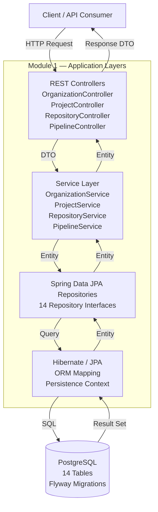

### Layer Responsibilities

| Layer | Responsibility | Key Classes |
|-------|---------------|-------------|
| **REST Controllers** | Accept HTTP requests, validate input using `@Valid`, delegate to services, return HTTP responses with status codes | `OrganizationController`, `ProjectController`, `RepositoryController`, `PipelineController` |
| **Service Layer** | Enforce business rules, validate entity existence, manage transactions, throw domain-specific exceptions | `OrganizationService`, `ProjectService`, `RepositoryService`, `PipelineService` |
| **Repository Layer** | Provide data-access abstractions over JPA, define query methods via Spring Data conventions | 14 `*Repository` interfaces extending `JpaRepository` |
| **Entity Layer** | Define the JPA domain model, map to database tables, express relationships and constraints | 14 `@Entity` classes in `domain.entity` |
| **Database Layer** | Store data persistently, enforce constraints, execute queries, manage concurrency | PostgreSQL (production) / H2 (test) |
| **Migration Layer** | Version-control schema changes, ensure reproducible database evolution | Flyway with `V1__create_domain_schema.sql` |

---

## 5. Domain Model Overview

The domain model represents the core business concepts of a CI/CD platform. Each entity corresponds to a distinct business concept with clear lifecycle semantics.

### Entity Summary

| # | Entity | Table | Purpose |
|---|--------|-------|---------|
| 1 | Organization | `organizations` | Top-level tenant; groups projects and users |
| 2 | Project | `projects` | Business unit within an organization; groups repositories and pipelines |
| 3 | Repository | `repositories` | Source code repository linked to a Git provider |
| 4 | Pipeline | `pipelines` | CI/CD workflow definition within a project |
| 5 | PipelineVersion | `pipeline_versions` | Immutable version of a pipeline's YAML configuration |
| 6 | PipelineRun | `pipeline_runs` | Execution instance of a pipeline version against a commit |
| 7 | PipelineStage | `pipeline_stages` | Ordered execution phase within a pipeline run |
| 8 | PipelineJob | `pipeline_jobs` | Individual unit of work within a stage |
| 9 | JobAttempt | `job_attempts` | Retry attempt of a specific job |
| 10 | WebhookEvent | `webhook_events` | Incoming webhook payload from a Git provider |
| 11 | OutboxEvent | `outbox_events` | Domain event pending publication via the outbox pattern |
| 12 | Artifact | `artifacts` | Build output produced during a pipeline run |
| 13 | Deployment | `deployments` | Deployment of a pipeline run result to a target environment |
| 14 | AuditEvent | `audit_events` | Immutable record of a significant platform action |

### Lifecycle Position

```mermaid
graph LR
    subgraph "Setup"
        Org[Organization] --> Proj[Project]
        Proj --> Repo[Repository]
        Proj --> Pipe[Pipeline]
    end

    subgraph "Configuration"
        Pipe --> Ver[PipelineVersion]
    end

    subgraph "Execution"
        Ver --> Run[PipelineRun]
        Run --> Stage[PipelineStage]
        Stage --> Job[PipelineJob]
        Job --> Attempt[JobAttempt]
    end

    subgraph "Outputs"
        Run --> Art[Artifact]
        Run --> Dep[Deployment]
    end

    subgraph "Events"
        Repo -.->|receives| Wh[WebhookEvent]
        Run -.->|emits| Out[OutboxEvent]
    end

    subgraph "Audit"
        Audit[AuditEvent] -.->|records| Run
    end
```

---

## 6. Domain Relationship Model

The following Mermaid ER diagram represents the actual database foreign-key relationships implemented in the codebase.

```mermaid
erDiagram
    organizations {
        uuid id PK
        varchar name
        varchar slug UK
        text description
        varchar status
        timestamptz created_at
        timestamptz updated_at
    }

    projects {
        uuid id PK
        uuid organization_id FK
        varchar name
        varchar slug
        text description
        varchar status
        timestamptz created_at
        timestamptz updated_at
    }

    repositories {
        uuid id PK
        uuid project_id FK
        varchar provider
        varchar repository_url
        varchar repository_name
        varchar default_branch
        varchar webhook_id
        varchar status
        timestamptz created_at
        timestamptz updated_at
    }

    pipelines {
        uuid id PK
        uuid project_id FK
        varchar name
        text description
        varchar status
        timestamptz created_at
        timestamptz updated_at
    }

    pipeline_versions {
        uuid id PK
        uuid pipeline_id FK
        integer version
        text yaml_content
        varchar commit_sha
        varchar created_by
        timestamptz created_at
    }

    pipeline_runs {
        uuid id PK
        uuid pipeline_version_id FK
        uuid repository_id FK
        varchar commit_sha
        varchar branch
        varchar trigger_type
        varchar triggered_by
        varchar status
        timestamptz started_at
        timestamptz finished_at
        timestamptz created_at
        timestamptz updated_at
    }

    pipeline_stages {
        uuid id PK
        uuid pipeline_run_id FK
        varchar name
        integer order_index
        varchar status
        timestamptz started_at
        timestamptz finished_at
    }

    pipeline_jobs {
        uuid id PK
        uuid pipeline_stage_id FK
        varchar name
        varchar job_type
        varchar status
        varchar worker_id
        timestamptz started_at
        timestamptz finished_at
        integer exit_code
    }

    job_attempts {
        uuid id PK
        uuid job_id FK
        integer attempt_number
        varchar status
        integer exit_code
        timestamptz started_at
        timestamptz finished_at
        varchar logs_location
    }

    webhook_events {
        uuid id PK
        varchar provider
        varchar delivery_id
        varchar event_type
        uuid repository_id FK
        jsonb payload
        timestamptz received_at
        timestamptz processed_at
        varchar status
        text error_message
    }

    outbox_events {
        uuid id PK
        varchar event_type
        varchar aggregate_type
        uuid aggregate_id
        jsonb payload
        varchar status
        timestamptz created_at
        timestamptz published_at
        text error_message
    }

    artifacts {
        uuid id PK
        uuid pipeline_run_id FK
        uuid job_id FK
        varchar artifact_type
        varchar name
        varchar location_url
        varchar image_digest
        timestamptz created_at
    }

    deployments {
        uuid id PK
        uuid pipeline_run_id FK
        varchar environment
        varchar image_digest
        varchar status
        timestamptz started_at
        timestamptz finished_at
        varchar endpoint
        timestamptz created_at
    }

    audit_events {
        uuid id PK
        varchar actor
        varchar action
        varchar resource_type
        uuid resource_id
        jsonb metadata
        varchar correlation_id
        varchar ip_address
        varchar user_agent
        timestamptz created_at
    }

    organizations ||--o{ projects : "has"
    projects ||--o{ repositories : "has"
    projects ||--o{ pipelines : "has"
    pipelines ||--o{ pipeline_versions : "versions"
    pipeline_versions ||--o{ pipeline_runs : "triggers"
    repositories ||--o{ pipeline_runs : "runs against"
    pipeline_runs ||--o{ pipeline_stages : "contains"
    pipeline_stages ||--o{ pipeline_jobs : "contains"
    pipeline_jobs ||--o{ job_attempts : "retries"
    pipeline_runs ||--o{ artifacts : "produces"
    pipeline_jobs ||--o{ artifacts : "may produce"
    pipeline_runs ||--o{ deployments : "deploys to"
    repositories ||--o{ webhook_events : "receives"
```

---

## 7. Entity-by-Entity Documentation

### 7.1 Organization

#### Purpose

Represents the top-level tenant in the platform. An organization groups users, projects, and all downstream resources. It provides multi-tenant isolation.

#### Key Attributes

| Field | Type | Nullable | Purpose |
|-------|------|----------|---------|
| `id` | `UUID` | No (PK) | Unique identifier, auto-generated |
| `name` | `String` | No | Human-readable display name |
| `slug` | `String` | No (unique) | URL-safe identifier, globally unique |
| `description` | `String` | Yes | Free-text description |
| `status` | `OrganizationStatus` | No | Lifecycle state: `ACTIVE`, `INACTIVE`, `SUSPENDED` |
| `created_at` | `Instant` | No | UTC creation timestamp, immutable |
| `updated_at` | `Instant` | No | UTC last-modified timestamp |

#### Relationships

- Parent of `Project` (one-to-many, lazy-loaded)

#### Constraints

- `slug` has a database-level `UNIQUE` constraint (`uq_organizations_slug` in Flyway)
- `status` is validated by a `CHECK` constraint against allowed enum values
- Index on `status` for filtering active organizations

#### Lifecycle

Created when a tenant is onboarded to the platform. Status transitions (`ACTIVE` → `SUSPENDED` → `ACTIVE`) are managed at the application level. This is a **root aggregate** with no parent entity.

---

### 7.2 Project

#### Purpose

Represents a business unit or product within an organization. A project groups related repositories and pipelines under a shared namespace.

#### Key Attributes

| Field | Type | Nullable | Purpose |
|-------|------|----------|---------|
| `id` | `UUID` | No (PK) | Unique identifier |
| `organization_id` | `UUID` | No (FK) | Parent organization |
| `name` | `String` | No | Display name |
| `slug` | `String` | No | URL-safe identifier, unique within organization |
| `description` | `String` | Yes | Free-text description |
| `status` | `ProjectStatus` | No | Lifecycle state: `ACTIVE`, `ARCHIVED`, `SUSPENDED` |
| `created_at` | `Instant` | No | UTC creation timestamp |
| `updated_at` | `Instant` | No | UTC last-modified timestamp |

#### Relationships

- Belongs to `Organization` (many-to-one, lazy-loaded, `ON DELETE RESTRICT`)
- Parent of `Repository` (one-to-many)
- Parent of `Pipeline` (one-to-many)

#### Constraints

- Composite unique constraint `uq_projects_org_slug` on `(organization_id, slug)` — slugs are unique per organization, not globally
- Foreign key to `organizations` with `ON DELETE RESTRICT` prevents deleting an organization that has projects
- Indexes on `organization_id` and `status`

#### Lifecycle

Created within an organization's context. The composite unique constraint allows different organizations to have projects with the same slug.

---

### 7.3 Repository

#### Purpose

Represents a source code repository linked to a Git provider. This entity bridges the CI/CD platform with the actual source code repositories that trigger pipelines.

#### Key Attributes

| Field | Type | Nullable | Purpose |
|-------|------|----------|---------|
| `id` | `UUID` | No (PK) | Unique identifier |
| `project_id` | `UUID` | No (FK) | Parent project |
| `provider` | `ProviderType` | No | Git provider: `GITHUB`, `GITLAB`, `BITBUCKET` |
| `repository_url` | `String` | No | Full repository URL (up to 1024 chars) |
| `repository_name` | `String` | No | Short name of the repository |
| `default_branch` | `String` | No | Default branch, typically `main` |
| `webhook_id` | `String` | Yes | Provider-specific webhook identifier |
| `status` | `RepositoryStatus` | No | State: `ACTIVE`, `INACTIVE`, `PENDING` |
| `created_at` | `Instant` | No | UTC creation timestamp |
| `updated_at` | `Instant` | No | UTC last-modified timestamp |

#### Relationships

- Belongs to `Project` (many-to-one, lazy-loaded, `ON DELETE RESTRICT`)
- Parent of `WebhookEvent` (one-to-many, optional)
- Referenced by `PipelineRun` (many-to-one, optional, `ON DELETE SET NULL`)

#### Constraints

- Composite unique constraint `uq_repositories_project_url` on `(project_id, repository_url)` — the same URL cannot be registered twice within a project
- `CHECK` constraint on `provider` and `status`
- Indexes on `project_id` and `status`

#### Lifecycle

Registered when a development team connects their source code repository to the platform. The `webhook_id` field is populated when a webhook is configured with the provider. The `PENDING` status indicates webhook registration is incomplete.

---

### 7.4 Pipeline

#### Purpose

Represents a CI/CD workflow definition. A pipeline defines the stages, jobs, and configuration for building, testing, and deploying code.

#### Key Attributes

| Field | Type | Nullable | Purpose |
|-------|------|----------|---------|
| `id` | `UUID` | No (PK) | Unique identifier |
| `project_id` | `UUID` | No (FK) | Parent project |
| `name` | `String` | No | Pipeline name |
| `description` | `String` | Yes | Free-text description |
| `status` | `PipelineStatus` | No | State: `ACTIVE`, `INACTIVE`, `ARCHIVED` |
| `created_at` | `Instant` | No | UTC creation timestamp |
| `updated_at` | `Instant` | No | UTC last-modified timestamp |

#### Relationships

- Belongs to `Project` (many-to-one, lazy-loaded, `ON DELETE RESTRICT`)
- Parent of `PipelineVersion` (one-to-many)
- Parent of `PipelineRun` (indirectly, through `PipelineVersion`)

#### Constraints

- Composite unique constraint `uq_pipelines_project_name` on `(project_id, name)` — pipeline names are unique within a project
- Foreign key to `projects` with `ON DELETE RESTRICT`
- Indexes on `project_id` and `status`

#### Lifecycle

Created when a team defines a new CI/CD workflow within a project. Pipelines are versioned through `PipelineVersion` rather than being mutated in place.

---

### 7.5 PipelineVersion

#### Purpose

Represents an immutable snapshot of a pipeline's YAML configuration. Each version captures the exact pipeline definition, the commit SHA it was derived from, and who created it. This provides full traceability of pipeline configuration changes.

#### Key Attributes

| Field | Type | Nullable | Purpose |
|-------|------|----------|---------|
| `id` | `UUID` | No (PK) | Unique identifier |
| `pipeline_id` | `UUID` | No (FK) | Parent pipeline |
| `version` | `Integer` | No | Sequential version number |
| `yaml_content` | `String` | No | Full YAML pipeline definition |
| `commit_sha` | `String` | Yes | Source commit this version was derived from |
| `created_by` | `String` | Yes | User or system that created this version |
| `created_at` | `Instant` | No | UTC creation timestamp, immutable |

#### Relationships

- Belongs to `Pipeline` (many-to-one, lazy-loaded, `ON DELETE RESTRICT`)
- Parent of `PipelineRun` (one-to-many)

#### Constraints

- Composite unique constraint `uq_pipeline_versions_pipeline_version` on `(pipeline_id, version)` — version numbers are sequential and unique per pipeline
- No `updated_at` field — versions are immutable once created
- Indexes on `pipeline_id` and `commit_sha`

#### Lifecycle

Created when a pipeline's configuration is updated. The service layer automatically increments the version number. Versions are never modified or deleted — this provides a complete audit trail of pipeline configuration changes.

---

### 7.6 PipelineRun

#### Purpose

Represents a single execution instance of a pipeline version. A run tracks the commit SHA, branch, trigger mechanism, and overall execution status. This is the central execution-tracking entity in the platform.

#### Key Attributes

| Field | Type | Nullable | Purpose |
|-------|------|----------|---------|
| `id` | `UUID` | No (PK) | Unique identifier |
| `pipeline_version_id` | `UUID` | No (FK) | Pipeline version being executed |
| `repository_id` | `UUID` | Yes (FK) | Source repository (nullable for manual triggers) |
| `commit_sha` | `String` | No | Git commit being built (40-char SHA) |
| `branch` | `String` | No | Git branch being built |
| `trigger_type` | `TriggerType` | No | How the run was started: `MANUAL`, `WEBHOOK`, `SCHEDULED`, `API` |
| `triggered_by` | `String` | Yes | User or system that initiated the run |
| `status` | `RunStatus` | No | Current state: `QUEUED`, `RUNNING`, `SUCCESS`, `FAILED`, `CANCELLED` |
| `started_at` | `Instant` | Yes | When execution began |
| `finished_at` | `Instant` | Yes | When execution completed |
| `created_at` | `Instant` | No | UTC creation timestamp |
| `updated_at` | `Instant` | No | UTC last-modified timestamp |

#### Relationships

- Belongs to `PipelineVersion` (many-to-one, lazy-loaded, `ON DELETE RESTRICT`)
- Belongs to `Repository` (many-to-one, lazy-loaded, nullable, `ON DELETE SET NULL`)
- Parent of `PipelineStage` (one-to-many)
- Parent of `Artifact` (one-to-many)
- Parent of `Deployment` (one-to-many)

#### Constraints

- Foreign key to `pipeline_versions` with `ON DELETE RESTRICT`
- Foreign key to `repositories` with `ON DELETE SET NULL` — if a repository is deleted, runs are preserved
- `CHECK` constraints on `status` and `trigger_type`
- Five indexes for efficient querying by version, repository, status, commit SHA, and creation time

#### Lifecycle

Created when a pipeline is triggered (manually, by webhook, on schedule, or via API). Starts in `QUEUED` status, transitions through `RUNNING`, and terminates in `SUCCESS`, `FAILED`, or `CANCELLED`. Timestamps (`started_at`, `finished_at`) track execution duration.

---

### 7.7 PipelineStage

#### Purpose

Represents an ordered execution phase within a pipeline run. Stages group related jobs and enforce sequential execution order (e.g., build before test before deploy).

#### Key Attributes

| Field | Type | Nullable | Purpose |
|-------|------|----------|---------|
| `id` | `UUID` | No (PK) | Unique identifier |
| `pipeline_run_id` | `UUID` | No (FK) | Parent pipeline run |
| `name` | `String` | No | Stage name (e.g., `build`, `test`) |
| `order_index` | `Integer` | No | Zero-based execution order |
| `status` | `StageStatus` | No | State: `PENDING`, `RUNNING`, `SUCCESS`, `FAILED`, `SKIPPED` |
| `started_at` | `Instant` | Yes | When stage execution began |
| `finished_at` | `Instant` | Yes | When stage execution completed |

#### Relationships

- Belongs to `PipelineRun` (many-to-one, lazy-loaded, `ON DELETE RESTRICT`)
- Parent of `PipelineJob` (one-to-many)

#### Constraints

- Composite unique constraint `uq_pipeline_stages_run_order` on `(pipeline_run_id, order_index)` — each run has at most one stage per order position
- Foreign key to `pipeline_runs` with `ON DELETE RESTRICT`
- Index on `pipeline_run_id`

#### Lifecycle

Created when a pipeline run is initialized. The `order_index` determines execution sequence. A `SKIPPED` status indicates the stage was bypassed (e.g., conditional logic in pipeline YAML).

---

### 7.8 PipelineJob

#### Purpose

Represents an individual unit of work within a pipeline stage. A job corresponds to a concrete task such as compiling code, running tests, or scanning for vulnerabilities.

#### Key Attributes

| Field | Type | Nullable | Purpose |
|-------|------|----------|---------|
| `id` | `UUID` | No (PK) | Unique identifier |
| `pipeline_stage_id` | `UUID` | No (FK) | Parent stage |
| `name` | `String` | No | Job name (e.g., `maven-build`) |
| `job_type` | `JobType` | No | Category: `BUILD`, `TEST`, `SCAN`, `DEPLOY`, `PACKAGE`, `CUSTOM` |
| `status` | `JobStatus` | No | State: `PENDING`, `QUEUED`, `RUNNING`, `SUCCESS`, `FAILED`, `CANCELLED` |
| `worker_id` | `String` | Yes | Identifier of the worker executing this job |
| `started_at` | `Instant` | Yes | When job execution began |
| `finished_at` | `Instant` | Yes | When job execution completed |
| `exit_code` | `Integer` | Yes | Process exit code on completion |

#### Relationships

- Belongs to `PipelineStage` (many-to-one, lazy-loaded, `ON DELETE RESTRICT`)
- Parent of `JobAttempt` (one-to-many)
- Referenced by `Artifact` (many-to-one, optional)

#### Constraints

- `CHECK` constraints on `status` and `job_type`
- Foreign key to `pipeline_stages` with `ON DELETE RESTRICT`
- Indexes on `pipeline_stage_id` and `status`

#### Lifecycle

Created when a pipeline run's stages are initialized. The `worker_id` field is populated when a worker picks up the job. The `exit_code` records the process result for debugging.

---

### 7.9 JobAttempt

#### Purpose

Represents a single retry attempt of a pipeline job. Jobs may be retried on failure, and each attempt records its own status, timing, and log location. This provides granular failure analysis.

#### Key Attributes

| Field | Type | Nullable | Purpose |
|-------|------|----------|---------|
| `id` | `UUID` | No (PK) | Unique identifier |
| `job_id` | `UUID` | No (FK) | Parent job |
| `attempt_number` | `Integer` | No | Sequential attempt number (1-based) |
| `status` | `AttemptStatus` | No | State: `PENDING`, `RUNNING`, `SUCCESS`, `FAILED`, `CANCELLED` |
| `exit_code` | `Integer` | Yes | Process exit code |
| `started_at` | `Instant` | Yes | When this attempt began |
| `finished_at` | `Instant` | Yes | When this attempt completed |
| `logs_location` | `String` | Yes | Storage path for execution logs (up to 1024 chars) |

#### Relationships

- Belongs to `PipelineJob` (many-to-one, lazy-loaded, `ON DELETE RESTRICT`)

#### Constraints

- Composite unique constraint `uq_job_attempts_job_attempt` on `(job_id, attempt_number)` — attempt numbers are unique per job
- Foreign key to `pipeline_jobs` with `ON DELETE RESTRICT`
- Index on `job_id`

#### Lifecycle

Created each time a job is (re)attempted. The first attempt has `attempt_number = 1`. Failed jobs may be retried, creating incrementing attempt records. The `logs_location` field will hold a reference to stored execution logs when log persistence is implemented.

---

### 7.10 WebhookEvent

#### Purpose

Records an incoming webhook payload from a Git provider. This entity stores the raw event data for later processing, deduplication, and audit. It uses a composite unique constraint on `(provider, delivery_id)` to prevent duplicate event ingestion.

#### Key Attributes

| Field | Type | Nullable | Purpose |
|-------|------|----------|---------|
| `id` | `UUID` | No (PK) | Unique identifier |
| `provider` | `String` | No | Source provider (e.g., `GITHUB`) |
| `delivery_id` | `String` | No | Provider-assigned delivery identifier |
| `event_type` | `String` | No | Event category (e.g., `push`, `pull_request`) |
| `repository_id` | `UUID` | Yes (FK) | Associated repository |
| `payload` | `Map<String,Object>` | Yes | Full JSON webhook payload |
| `received_at` | `Instant` | No | UTC timestamp when the webhook was received |
| `processed_at` | `Instant` | Yes | UTC timestamp when processing completed |
| `status` | `WebhookEventStatus` | No | State: `RECEIVED`, `PROCESSING`, `PROCESSED`, `REJECTED`, `FAILED` |
| `error_message` | `String` | Yes | Error details if processing failed |

#### Relationships

- Belongs to `Repository` (many-to-one, lazy-loaded, nullable, `ON DELETE SET NULL`)

#### Constraints

- Composite unique constraint `uq_webhook_events_provider_delivery` on `(provider, delivery_id)` — the same delivery cannot be recorded twice
- Foreign key to `repositories` with `ON DELETE SET NULL`
- `CHECK` constraint on `status`
- Indexes on `repository_id`, `status`, and `received_at DESC`
- `payload` uses `@JdbcTypeCode(SqlTypes.JSON)` with `columnDefinition = "TEXT"` for cross-database compatibility

#### Lifecycle

Created immediately when a webhook HTTP request arrives. Starts in `RECEIVED` status. Processing logic (implemented in a future module) will transition through `PROCESSING` to `PROCESSED` or `FAILED`. The `delivery_id` enables idempotent ingestion.

---

### 7.11 OutboxEvent

#### Purpose

Implements the **transactional outbox pattern**. Domain events are written to this table within the same transaction as the business state change, ensuring atomicity. A separate publisher process polls for `PENDING` events and delivers them to RabbitMQ (or another message broker). This pattern guarantees at-least-once event delivery without distributed transactions.

#### Key Attributes

| Field | Type | Nullable | Purpose |
|-------|------|----------|---------|
| `id` | `UUID` | No (PK) | Unique identifier |
| `event_type` | `String` | No | Domain event type (e.g., `RUN_CREATED`) |
| `aggregate_type` | `String` | No | Type of aggregate that produced the event (e.g., `PipelineRun`) |
| `aggregate_id` | `UUID` | No | ID of the aggregate instance |
| `payload` | `String` | No | JSON event payload |
| `status` | `OutboxEventStatus` | No | State: `PENDING`, `PUBLISHED`, `FAILED` |
| `created_at` | `Instant` | No | UTC creation timestamp |
| `published_at` | `Instant` | Yes | UTC timestamp when the event was published |
| `error_message` | `String` | Yes | Error details if publishing failed |

#### Relationships

- Standalone entity — references aggregates by type and ID without foreign keys

#### Constraints

- `CHECK` constraint on `status`
- Indexes on `status` and `created_at ASC`
- A partial index `idx_outbox_events_pending` filters `WHERE status = 'PENDING'` for efficient polling
- `payload` uses `columnDefinition = "TEXT"` (not `@Lob`) for H2 compatibility

#### Lifecycle

Created when a domain action occurs (e.g., a pipeline run is queued). Starts as `PENDING`. A future publisher module will poll for pending events, deliver them to the message broker, and mark them as `PUBLISHED` or `FAILED`.

---

### 7.12 Artifact

#### Purpose

Records a build output produced during a pipeline run. Artifacts include Docker images, Maven JARs, NPM packages, and generic files. Each artifact tracks its storage location and optional image digest for container images.

#### Key Attributes

| Field | Type | Nullable | Purpose |
|-------|------|----------|---------|
| `id` | `UUID` | No (PK) | Unique identifier |
| `pipeline_run_id` | `UUID` | No (FK) | Pipeline run that produced this artifact |
| `job_id` | `UUID` | Yes (FK) | Specific job that produced this artifact |
| `artifact_type` | `ArtifactType` | No | Category: `DOCKER_IMAGE`, `MAVEN_JAR`, `NPM_PACKAGE`, `GENERIC` |
| `name` | `String` | No | Artifact name (e.g., `api:latest`) |
| `location_url` | `String` | No | Storage location URL (up to 1024 chars) |
| `image_digest` | `String` | Yes | Container image digest (for `DOCKER_IMAGE` type) |
| `created_at` | `Instant` | No | UTC creation timestamp, immutable |

#### Relationships

- Belongs to `PipelineRun` (many-to-one, lazy-loaded, `ON DELETE RESTRICT`)
- Optionally belongs to `PipelineJob` (many-to-one, lazy-loaded, nullable, `ON DELETE SET NULL`)

#### Constraints

- `CHECK` constraint on `artifact_type`
- Foreign key to `pipeline_runs` with `ON DELETE RESTRICT`
- Foreign key to `pipeline_jobs` with `ON DELETE SET NULL`
- Index on `pipeline_run_id`

#### Lifecycle

Created when a build job produces output. The `image_digest` field is populated for Docker image artifacts to support supply-chain verification.

---

### 7.13 Deployment

#### Purpose

Records the deployment of a pipeline run result to a target environment. Tracks the deployment lifecycle from pending through deploying to success, failure, or rollback.

#### Key Attributes

| Field | Type | Nullable | Purpose |
|-------|------|----------|---------|
| `id` | `UUID` | No (PK) | Unique identifier |
| `pipeline_run_id` | `UUID` | No (FK) | Pipeline run being deployed |
| `environment` | `String` | No | Target environment (e.g., `staging`, `production`) |
| `image_digest` | `String` | Yes | Container image being deployed |
| `status` | `DeploymentStatus` | No | State: `PENDING`, `DEPLOYING`, `SUCCESS`, `FAILED`, `ROLLED_BACK` |
| `started_at` | `Instant` | Yes | When deployment began |
| `finished_at` | `Instant` | Yes | When deployment completed |
| `endpoint` | `String` | Yes | Deployed service URL (up to 1024 chars) |
| `created_at` | `Instant` | No | UTC creation timestamp, immutable |

#### Relationships

- Belongs to `PipelineRun` (many-to-one, lazy-loaded, `ON DELETE RESTRICT`)

#### Constraints

- `CHECK` constraint on `status`
- Foreign key to `pipeline_runs` with `ON DELETE RESTRICT`
- Indexes on `pipeline_run_id` and `environment`

#### Lifecycle

Created when a pipeline run reaches the deployment stage. Transitions through `PENDING` → `DEPLOYING` → `SUCCESS`/`FAILED`/`ROLLED_BACK`. The `ROLLED_BACK` status is unique to deployments and supports rollback tracking.

---

### 7.14 AuditEvent

#### Purpose

Provides an immutable audit trail of significant platform actions. Each event records who did what to which resource, when, from where, and with what correlation context. This entity supports compliance, debugging, and operational analysis.

#### Key Attributes

| Field | Type | Nullable | Purpose |
|-------|------|----------|---------|
| `id` | `UUID` | No (PK) | Unique identifier |
| `actor` | `String` | No | User or system that performed the action |
| `action` | `String` | No | Action performed (e.g., `PROJECT_CREATED`) |
| `resource_type` | `String` | No | Type of affected resource (e.g., `Project`) |
| `resource_id` | `UUID` | No | ID of the affected resource |
| `metadata` | `Map<String,Object>` | Yes | Additional context as key-value pairs |
| `correlation_id` | `String` | Yes | Request correlation ID for distributed tracing |
| `ip_address` | `String` | Yes | Client IP address (up to 45 chars for IPv6) |
| `user_agent` | `String` | Yes | Client user agent string |
| `created_at` | `Instant` | No | UTC creation timestamp, immutable |

#### Relationships

- Standalone entity — references resources by type and ID without foreign keys

#### Constraints

- No `updated_at` — audit events are immutable after creation
- Indexes on `(resource_type, resource_id)`, `created_at DESC`, `correlation_id`, and `actor`
- `metadata` uses `@JdbcTypeCode(SqlTypes.JSON)` with `columnDefinition = "TEXT"` for cross-database compatibility

#### Lifecycle

Created whenever a significant platform action occurs (e.g., organization created, pipeline run triggered). These events are append-only and provide a complete operational history.

---

## 8. Database Schema

### Schema Design Principles

- **UUID primary keys** — All 14 tables use UUIDs as primary keys, generated via `gen_random_uuid()` in PostgreSQL and `GenerationType.UUID` in JPA. UUIDs prevent enumeration attacks and support distributed ID generation.
- **Snake-case naming** — All database columns use `snake_case`, following PostgreSQL conventions.
- **UTC timestamps** — All timestamp columns use `TIMESTAMPTZ` (with time zone) to avoid timezone ambiguity.
- **TEXT for unbounded strings** — Description, payload, and error message fields use `TEXT` rather than `VARCHAR` to avoid arbitrary length limits.
- **CHECK constraints** — Every status and enum column is constrained to valid values at the database level.
- **Foreign keys with ON DELETE behavior** — Most foreign keys use `ON DELETE RESTRICT` to prevent accidental data loss. The `repositories` FK in `pipeline_runs` uses `ON DELETE SET NULL` to preserve run history if a repository is removed.

### Table Summary

| Table | Purpose | Primary Key | Important Relationships |
|-------|---------|-------------|------------------------|
| `organizations` | Tenant isolation | `id` (UUID) | Parent of `projects` |
| `projects` | Business grouping | `id` (UUID) | FK to `organizations`; parent of `repositories`, `pipelines` |
| `repositories` | Source code linkage | `id` (UUID) | FK to `projects`; referenced by `pipeline_runs`, `webhook_events` |
| `pipelines` | CI/CD workflow definition | `id` (UUID) | FK to `projects`; parent of `pipeline_versions` |
| `pipeline_versions` | Immutable pipeline config | `id` (UUID) | FK to `pipelines`; parent of `pipeline_runs` |
| `pipeline_runs` | Execution instance | `id` (UUID) | FK to `pipeline_versions`, `repositories`; parent of `stages`, `artifacts`, `deployments` |
| `pipeline_stages` | Ordered execution phase | `id` (UUID) | FK to `pipeline_runs`; parent of `pipeline_jobs` |
| `pipeline_jobs` | Unit of work | `id` (UUID) | FK to `pipeline_stages`; parent of `job_attempts` |
| `job_attempts` | Retry attempt | `id` (UUID) | FK to `pipeline_jobs` |
| `webhook_events` | Incoming webhook data | `id` (UUID) | FK to `repositories` |
| `outbox_events` | Pending domain events | `id` (UUID) | Standalone (aggregate-based references) |
| `artifacts` | Build outputs | `id` (UUID) | FK to `pipeline_runs`, `pipeline_jobs` |
| `deployments` | Deployment records | `id` (UUID) | FK to `pipeline_runs` |
| `audit_events` | Audit trail | `id` (UUID) | Standalone (resource-based references) |

### Indexes

The schema defines **32 indexes** across 14 tables, covering foreign key columns for join performance, status columns for filtered queries, and timestamp columns for chronological ordering. Notable indexes include:

- `idx_pipeline_runs_created_at DESC` — Supports efficient "most recent runs first" queries
- `idx_webhook_events_received_at DESC` — Supports chronological webhook event browsing
- `idx_outbox_events_pending` — Partial index filtering `WHERE status = 'PENDING'` for efficient outbox polling
- `idx_audit_events_resource` — Composite index on `(resource_type, resource_id)` for resource-specific audit lookups

---

## 9. Flyway Database Migration

### Why Flyway

Flyway provides **version-controlled, repeatable, and idempotent database schema management**. In an enterprise CI/CD platform:

- Schema changes must be traceable to version control
- Multiple developers and deployment environments must converge on the same schema
- Schema evolution must be auditable and reversible
- Production databases must never be modified by Hibernate auto-DDL

### Migration File

`backend/src/main/resources/db/migration/V1__create_domain_schema.sql`

This single migration creates all 14 tables, 32 indexes, 7 composite unique constraints, 14 `CHECK` constraints, and all foreign key relationships. The naming convention `V1__create_domain_schema.sql` follows Flyway's versioned migration format: `V{version}__{description}.sql`.

### Production Configuration

```yaml
spring:
  jpa:
    hibernate:
      ddl-auto: validate      # Hibernate validates, never modifies schema
  flyway:
    enabled: true              # Flyway manages schema
    locations: classpath:db/migration
    validate-on-migrate: true  # Validate migration checksums
```

The `ddl-auto=validate` strategy instructs Hibernate to verify that the existing database schema matches the JPA entity mappings at application startup. If there is a mismatch, the application fails fast with a clear error rather than silently modifying production data. This is the recommended strategy for production environments because:

1. It prevents accidental schema changes
2. It forces all schema changes through Flyway migrations
3. It catches deployment errors (e.g., missing migration) at startup
4. It ensures the application and database are always in sync

---

## 10. JPA / Hibernate Mapping Strategy

### Core Annotations Used

| Annotation | Purpose | Example |
|------------|---------|---------|
| `@Entity` | Marks a class as a JPA entity mapped to a database table | `@Entity @Table(name = "organizations")` |
| `@Id` | Designates the primary key field | `@Id @GeneratedValue(strategy = GenerationType.UUID)` |
| `@Column` | Configures column mapping, nullability, length, and type | `@Column(nullable = false, length = 255)` |
| `@ManyToOne` | Maps a many-to-one relationship with lazy loading | `@ManyToOne(fetch = FetchType.LAZY, optional = false)` |
| `@JoinColumn` | Specifies the foreign key column name | `@JoinColumn(name = "organization_id")` |
| `@Enumerated(EnumType.STRING)` | Maps Java enums to string database values | Ensures human-readable values in the database |
| `@Table(uniqueConstraints)` | Declares composite unique constraints | `@UniqueConstraint(columnNames = {"organization_id", "slug"})` |
| `@Index` | Declares database indexes | `@Index(name = "idx_organizations_status", columnList = "status")` |
| `@PrePersist` | Lifecycle callback to set timestamps on creation | Sets `createdAt` and `updatedAt` |
| `@PreUpdate` | Lifecycle callback to update timestamps on modification | Sets `updatedAt` |
| `@JdbcTypeCode(SqlTypes.JSON)` | Maps a Java type to a JSON column type | Used for `Map<String, Object>` fields |

### Mapping Patterns

**UUID identifiers** — All entities use `@GeneratedValue(strategy = GenerationType.UUID)`, which delegates ID generation to the JPA provider. In PostgreSQL, this maps to `gen_random_uuid()`. In H2, the provider handles UUID generation natively.

**Lazy loading** — All `@ManyToOne` relationships use `FetchType.LAZY` to prevent unnecessary database queries. This is critical for the entity hierarchy where loading a `PipelineRun` should not eagerly load its `PipelineVersion`, `Pipeline`, `Project`, and `Organization`.

**JSON fields** — `WebhookEvent.payload` and `AuditEvent.metadata` use `Map<String, Object>` with `@JdbcTypeCode(SqlTypes.JSON)` for Hibernate 6.x JSON support. The `columnDefinition = "TEXT"` ensures H2 compatibility while PostgreSQL maps this to `JSONB` at the SQL level.

**Timestamps** — All entities use `java.time.Instant` for timestamps, which maps to `TIMESTAMPTZ` in PostgreSQL. The `@PrePersist` and `@PreUpdate` lifecycle callbacks maintain `created_at` and `updated_at` automatically.

---

## 11. Repository Layer

### Repository Abstractions

Spring Data JPA repositories provide a query-method abstraction over Hibernate. By extending `JpaRepository`, each repository inherits standard CRUD operations (`save`, `findById`, `findAll`, `deleteById`) and gains the ability to define custom queries through method name conventions.

### Repository Responsibilities

- Provide type-safe data access for a specific entity
- Define custom query methods using Spring Data naming conventions
- Execute queries through Hibernate's query planner
- Support transactional data access

### Repository Design Principles

- Repositories should **not** contain business logic
- Repositories should **not** perform cross-aggregate validation
- Complex queries should use `@Query` annotations or specifications rather than N+1 loading patterns

### Repository Summary

| Repository | Entity | Custom Query Methods |
|------------|--------|---------------------|
| `OrganizationRepository` | `Organization` | `findBySlug(String)`, `existsBySlug(String)` |
| `ProjectRepository` | `Project` | `findByOrganizationId(UUID)`, `findByOrganizationIdAndSlug(UUID, String)`, `existsByOrganizationIdAndSlug(UUID, String)` |
| `RepositoryRepository` | `Repository` | `findByProjectId(UUID)` |
| `PipelineRepository` | `Pipeline` | `findByProjectId(UUID)` |
| `PipelineVersionRepository` | `PipelineVersion` | `findByPipelineIdOrderByVersionDesc(UUID)`, `findByPipelineIdAndVersion(UUID, Integer)` |
| `PipelineRunRepository` | `PipelineRun` | `findByPipelineVersionIdOrderByCreatedAtDesc(UUID)`, `findByRepositoryIdOrderByCreatedAtDesc(UUID)`, `findByCommitSha(String)` |
| `PipelineStageRepository` | `PipelineStage` | `findByPipelineRunIdOrderByOrderIndexAsc(UUID)` |
| `PipelineJobRepository` | `PipelineJob` | `findByPipelineStageId(UUID)` |
| `JobAttemptRepository` | `JobAttempt` | `findByJobIdOrderByAttemptNumberAsc(UUID)` |
| `WebhookEventRepository` | `WebhookEvent` | `findByProviderAndDeliveryId(String, String)`, `existsByProviderAndDeliveryId(String, String)` |
| `OutboxEventRepository` | `OutboxEvent` | `findByStatusOrderByCreatedAtAsc(OutboxEventStatus)` |
| `ArtifactRepository` | `Artifact` | `findByPipelineRunId(UUID)` |
| `DeploymentRepository` | `Deployment` | `findByPipelineRunId(UUID)`, `findByEnvironmentOrderByCreatedAtDesc(String)` |
| `AuditEventRepository` | `AuditEvent` | `findByResourceTypeAndResourceIdOrderByCreatedAtDesc(String, UUID)`, `findByCorrelationId(String)` |

---

## 12. Service Layer

### Service Responsibilities

Services encapsulate business rules, validate entity relationships, and manage transaction boundaries. They sit between controllers and repositories, ensuring that controllers remain thin and repositories remain focused on data access.

### OrganizationService

**Class:** `com.cicd.platform.controlplane.domain.service.OrganizationService`

| Method | Transaction | Description |
|--------|-------------|-------------|
| `create(name, slug, description)` | Read-Write | Validates slug uniqueness via `existsBySlug`, creates organization |
| `findById(id)` | Read-Only | Retrieves organization or throws `ResourceNotFoundException` |
| `findAll()` | Read-Only | Returns all organizations |

**Validation rules:**
- Slug must be unique across all organizations (checked at application level before database insert)
- Non-existent organization IDs produce `ResourceNotFoundException`

### ProjectService

**Class:** `com.cicd.platform.controlplane.domain.service.ProjectService`

| Method | Transaction | Description |
|--------|-------------|-------------|
| `create(organizationId, name, slug, description)` | Read-Write | Validates organization exists and slug is unique within the organization |
| `findById(id)` | Read-Only | Retrieves project or throws `ResourceNotFoundException` |
| `findByOrganizationId(organizationId)` | Read-Only | Returns all projects for an organization |

**Validation rules:**
- Organization must exist (checked via `organizationRepository.findById`)
- Slug must be unique within the specified organization (checked via `existsByOrganizationIdAndSlug`)

### RepositoryService

**Class:** `com.cicd.platform.controlplane.domain.service.RepositoryService`

| Method | Transaction | Description |
|--------|-------------|-------------|
| `create(projectId, provider, url, name, branch)` | Read-Write | Validates project exists, validates provider type, defaults branch to `main` |
| `findById(id)` | Read-Only | Retrieves repository or throws `ResourceNotFoundException` |
| `findByProjectId(projectId)` | Read-Only | Returns all repositories for a project |

**Validation rules:**
- Project must exist
- Provider string must match a valid `ProviderType` enum value (case-insensitive)
- Invalid providers throw `BusinessRuleException`
- Default branch defaults to `"main"` if blank or null

### PipelineService

**Class:** `com.cicd.platform.controlplane.domain.service.PipelineService`

| Method | Transaction | Description |
|--------|-------------|-------------|
| `create(projectId, name, description)` | Read-Write | Validates project exists, creates pipeline |
| `findById(id)` | Read-Only | Retrieves pipeline or throws `ResourceNotFoundException` |
| `findByProjectId(projectId)` | Read-Only | Returns all pipelines for a project |
| `findVersions(pipelineId)` | Read-Only | Returns all versions for a pipeline, ordered by version descending |
| `addVersion(pipelineId, yamlContent, commitSha, createdBy)` | Read-Write | Auto-increments version number, creates immutable version |

**Validation rules:**
- Project must exist for pipeline creation
- Pipeline must exist for version creation
- Version numbers are auto-incremented by querying the latest existing version

---

## 13. REST API Layer

### Base Path

All endpoints are prefixed with `/api/v1/`.

### OrganizationController

**Path:** `/api/v1/organizations`

| Method | Endpoint | Purpose | Request Body | Response |
|--------|----------|---------|--------------|----------|
| `POST` | `/api/v1/organizations` | Create an organization | `CreateOrganizationRequest` | `201 CREATED` + `OrganizationResponse` |
| `GET` | `/api/v1/organizations/{id}` | Get organization by ID | — | `200 OK` + `OrganizationResponse` |
| `GET` | `/api/v1/organizations` | List all organizations | — | `200 OK` + `List<OrganizationResponse>` |

### ProjectController

**Path:** `/api/v1/projects`

| Method | Endpoint | Purpose | Request Body / Params | Response |
|--------|----------|---------|----------------------|----------|
| `POST` | `/api/v1/projects` | Create a project | `CreateProjectRequest` | `201 CREATED` + `ProjectResponse` |
| `GET` | `/api/v1/projects/{id}` | Get project by ID | — | `200 OK` + `ProjectResponse` |
| `GET` | `/api/v1/projects?organizationId={uuid}` | List projects by organization | Query param `organizationId` | `200 OK` + `List<ProjectResponse>` |

### RepositoryController

**Path:** `/api/v1/repositories`

| Method | Endpoint | Purpose | Request Body / Params | Response |
|--------|----------|---------|----------------------|----------|
| `POST` | `/api/v1/repositories` | Register a repository | `CreateRepositoryRequest` | `201 CREATED` + `RepositoryResponse` |
| `GET` | `/api/v1/repositories/{id}` | Get repository by ID | — | `200 OK` + `RepositoryResponse` |
| `GET` | `/api/v1/repositories?projectId={uuid}` | List repositories by project | Query param `projectId` | `200 OK` + `List<RepositoryResponse>` |

### PipelineController

**Path:** `/api/v1/pipelines`

| Method | Endpoint | Purpose | Request Body / Params | Response |
|--------|----------|---------|----------------------|----------|
| `POST` | `/api/v1/pipelines` | Create a pipeline | `CreatePipelineRequest` | `201 CREATED` + `PipelineResponse` |
| `GET` | `/api/v1/pipelines/{id}` | Get pipeline by ID | — | `200 OK` + `PipelineResponse` |
| `GET` | `/api/v1/pipelines?projectId={uuid}` | List pipelines by project | Query param `projectId` | `200 OK` + `List<PipelineResponse>` |
| `GET` | `/api/v1/pipelines/{id}/versions` | List pipeline versions | — | `200 OK` + `List<PipelineVersionResponse>` |

### HealthController

**Path:** `/api/v1/health`

| Method | Endpoint | Purpose | Response |
|--------|----------|---------|----------|
| `GET` | `/api/v1/health` | Platform health check | `200 OK` (`UP`) or `503 SERVICE UNAVAILABLE` (`DEGRADED`) + `HealthResponse` |

The health endpoint checks database connectivity (via JDBC metadata) and RabbitMQ connectivity (via `RabbitTemplate`). If either component is unreachable, the endpoint returns `503 DEGRADED` with component-level status details.

---

## 14. DTO Architecture

### Why DTOs

DTOs (Data Transfer Objects) provide several enterprise-critical benefits:

1. **API contract stability** — Entity field changes do not propagate to API consumers
2. **Security** — Internal entity relationships, lazy-loading proxies, and sensitive fields are not exposed
3. **Validation** — Request DTOs carry `@Valid` annotations defining input constraints
4. **Separation of concerns** — Controllers transform entities to/from DTOs, keeping domain logic clean

### Request DTOs

| DTO | Type | Fields | Validation |
|-----|------|--------|------------|
| `CreateOrganizationRequest` | record | `name`, `slug`, `description` | `@NotBlank` on name/slug, `@Size(max=255)` on name, `@Size(max=100)` on slug, `@Size(max=2000)` on description |
| `CreateProjectRequest` | record | `organizationId`, `name`, `slug`, `description` | `@NotNull` on organizationId, `@NotBlank` on name/slug, same size constraints |
| `CreateRepositoryRequest` | record | `projectId`, `provider`, `repositoryUrl`, `repositoryName`, `defaultBranch` | `@NotNull` on projectId, `@NotBlank` on provider/url/name, `@Size(max=1024)` on url |
| `CreatePipelineRequest` | record | `projectId`, `name`, `description` | `@NotNull` on projectId, `@NotBlank` on name, `@Size(max=255)` on name, `@Size(max=2000)` on description |

### Response DTOs

| DTO | Type | Factory Method | Notes |
|-----|------|---------------|-------|
| `OrganizationResponse` | record | `from(Organization)` | Exposes `id`, `name`, `slug`, `description`, `status` (as String), `createdAt`, `updatedAt` |
| `ProjectResponse` | record | `from(Project)` | Exposes `id`, `organizationId` (flattened from relationship), `name`, `slug`, `status`, timestamps |
| `RepositoryResponse` | record | `from(Repository)` | Exposes `id`, `projectId`, `provider` (as String), `repositoryUrl`, `repositoryName`, `defaultBranch`, `status`, timestamps |
| `PipelineResponse` | record | `from(Pipeline)` | Exposes `id`, `projectId`, `name`, `description`, `status`, timestamps |
| `PipelineVersionResponse` | record | `from(PipelineVersion)` | Exposes `id`, `pipelineId`, `version`, `commitSha`, `createdBy`, `createdAt` |

### Error DTO

| DTO | Type | Fields |
|-----|------|--------|
| `ApiErrorResponse` | record | `code` (String), `message` (String), `details` (Map<String, String>), `timestamp` (Instant) |

The `details` map is populated with per-field validation errors for `400 BAD_REQUEST` responses. For other error types, it defaults to an empty map.

### Design Pattern

All response DTOs use a static `from(Entity)` factory method for entity-to-DTO transformation. This centralizes the mapping logic and avoids reflection-based mapping libraries. Enum values are converted to strings using `.name()` to keep the API contract as plain strings rather than enum constants.

---

## 15. Exception Handling

### Exception Flow

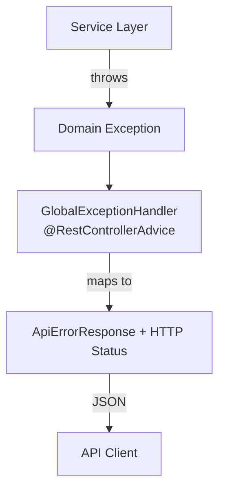

### Exception Classes

| Exception | HTTP Status | Error Code | When Thrown |
|-----------|-------------|------------|-------------|
| `ResourceNotFoundException` | `404 NOT_FOUND` | `RESOURCE_NOT_FOUND` | Entity not found by ID or lookup query |
| `ResourceConflictException` | `409 CONFLICT` | `RESOURCE_CONFLICT` | Duplicate slug or unique constraint violation detected at application level |
| `BusinessRuleException` | `422 UNPROCESSABLE_ENTITY` | `BUSINESS_RULE_VIOLATION` | Business rule violated (e.g., unsupported provider type) |
| `MethodArgumentNotValidException` | `400 BAD_REQUEST` | `VALIDATION_FAILED` | `@Valid` constraint violation on request DTO |
| `Exception` (catch-all) | `500 INTERNAL_SERVER_ERROR` | `INTERNAL_ERROR` | Unexpected runtime error |

### GlobalExceptionHandler

**Class:** `com.cicd.platform.controlplane.api.exception.GlobalExceptionHandler`

Annotated with `@RestControllerAdvice`, this class intercepts exceptions thrown by controllers and transforms them into structured `ApiErrorResponse` JSON. The `MethodArgumentNotValidException` handler iterates over `BindingResult` field errors and populates the `details` map with field-name-to-error-message pairs.

All exception classes extend `RuntimeException` and accept a single `String message` constructor. This keeps exception handling simple and prevents checked-exception boilerplate in service code.

---

## 16. Data Integrity

Data integrity is enforced at **three levels**: application validation, service-level business rules, and database constraints.

### Application Level (DTO Validation)

Request DTOs use Jakarta Validation annotations:
- `@NotBlank` — Prevents null or empty required fields
- `@NotNull` — Prevents null UUID references
- `@Size(max=N)` — Enforces maximum field lengths

### Service Level (Business Rules)

Services perform entity-existence checks and business-rule validation:
- `existsBySlug(slug)` before organization creation
- `existsByOrganizationIdAndSlug(organizationId, slug)` before project creation
- `findById(parentId)` before child entity creation
- `ProviderType.valueOf()` for provider validation

### Database Level (Schema Constraints)

| Constraint Type | Count | Purpose |
|----------------|-------|---------|
| Primary keys (UUID) | 14 | Unique row identification |
| Foreign keys | 14 | Referential integrity between tables |
| Composite unique constraints | 7 | Prevent duplicate slugs, versions, attempts, etc. |
| CHECK constraints | 14 | Validate enum/status values at the database level |
| NOT NULL constraints | ~50 | Enforce required fields |
| Indexes | 32 | Query performance and unique enforcement |

### Why Both Levels Are Necessary

Application-level validation provides a **better user experience** — errors are returned as structured API responses with human-readable messages. Database constraints provide a **safety net** — they prevent data corruption even if application logic has bugs or if data is inserted through non-API channels (e.g., direct database access, data migrations, or concurrent requests). In enterprise systems, relying on only one level of validation is insufficient.

---

## 17. Testing Architecture

### Test Strategy

Module 1 uses a three-tier testing approach: unit tests for service logic, MockMvc integration tests for controller-to-database flows, and repository-level integration tests for constraint verification.

### Unit Tests

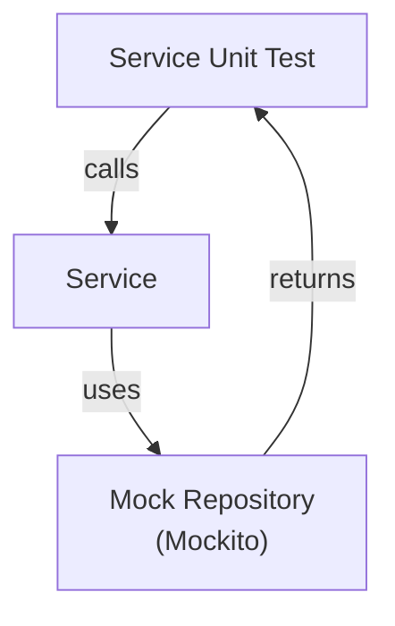

Unit tests verify service business logic in isolation. Repositories are mocked using Mockito, so no database interaction occurs. These tests run fast and validate business rules, exception throwing, and entity construction.

| Test Class | Tests | Coverage |
|------------|-------|----------|
| `OrganizationServiceTest` | 4 | Create, duplicate slug, find by ID, not found |
| `ProjectServiceTest` | 5 | Create, org not found, duplicate slug, find by ID, not found |
| `RepositoryServiceTest` | 6 | Create, project not found, invalid provider, default branch, find by ID, not found |
| `PipelineServiceTest` | 4 | Create, project not found, find by ID, not found |

### Integration Tests — CRUD

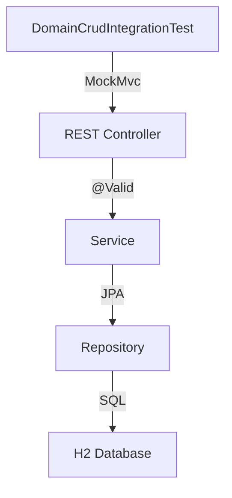

The `DomainCrudIntegrationTest` runs a full Spring context with MockMvc. It sends HTTP requests to controllers, which flow through services, repositories, and an in-memory H2 database. This validates the entire request-to-database pipeline.

| Test | Purpose |
|------|---------|
| `createAndGetOrganization` | POST then GET organization |
| `getOrganizationById` | GET existing organization |
| `listOrganizations` | GET all organizations |
| `createAndGetProject` | POST then GET project |
| `createAndGetRepository` | POST then GET repository |
| `createAndGetPipeline` | POST then GET pipeline |
| `fullHierarchyPersistence` | Persist all 14 entity types in a single transaction |
| `validationShouldRejectEmptyName` | Verify `400` for blank name |
| `validationShouldRejectMissingOrgId` | Verify `400` for null organization ID |
| `getNonexistentShould404` | Verify `404` for unknown UUID |
| `healthEndpointStillWorks` | Verify health endpoint responds |

### Integration Tests — Repository

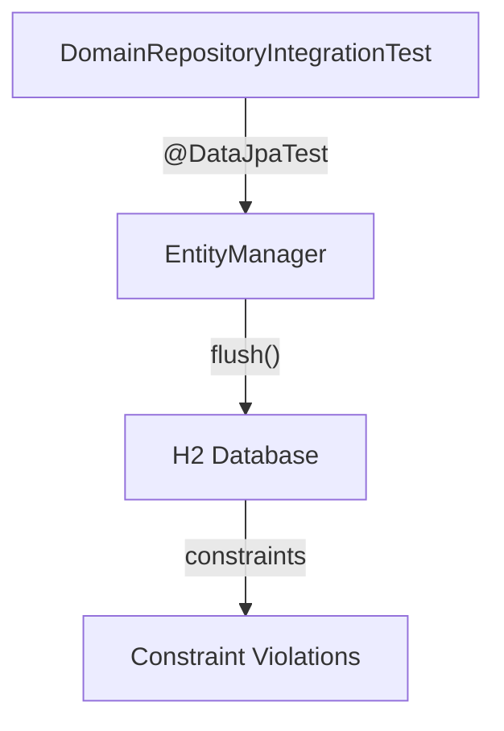

The `DomainRepositoryIntegrationTest` uses `@DataJpaTest` for a sliced JPA context. It tests database-level constraints, query methods, and entity persistence directly through repositories.

| Test | Purpose |
|------|---------|
| `fullHierarchyShouldPersist` | Persist and verify all 14 entity types |
| `webhookDeliveryIdShouldBeUnique` | Verify unique constraint on `(provider, delivery_id)` |
| `outboxEventShouldPersistWithJsonPayload` | Verify TEXT payload persistence and retrieval |
| `auditEventShouldPersistMetadata` | Verify JSON metadata persistence and retrieval |
| `artifactShouldPersist` | Verify artifact persistence and query |
| `deploymentShouldPersist` | Verify deployment persistence and query |
| `organizationSlugShouldBeUnique` | Verify unique constraint on organization slug |
| `projectSlugShouldBeUniquePerOrg` | Verify composite unique constraint on project slug |
| `pipelineVersionsShouldListDescending` | Verify version ordering query |
| `pipelineStagesShouldListOrdered` | Verify stage ordering by `order_index` |
| `jobAttemptsShouldListOrdered` | Verify attempt ordering by `attempt_number` |
| `outboxPendingEventsShouldBeQueryable` | Verify pending event status filtering |

### Verified Result

```
Tests run: 45
Failures: 0
Errors: 0
Skipped: 0
BUILD SUCCESS
```

| Test Class | Tests | Type |
|------------|-------|------|
| `ControlPlaneApplicationTests` | 1 | Context smoke test |
| `OrganizationServiceTest` | 4 | Unit |
| `ProjectServiceTest` | 5 | Unit |
| `RepositoryServiceTest` | 6 | Unit |
| `PipelineServiceTest` | 4 | Unit |
| `DomainCrudIntegrationTest` | 11 | Integration (MockMvc) |
| `DomainRepositoryIntegrationTest` | 12 | Integration (Repository) |
| `HealthControllerTest` | 2 | Integration (Health) |
| **Total** | **45** | |

---

## 18. H2 vs PostgreSQL

### Why H2 for Testing

H2 is an in-memory Java database that starts in milliseconds, requires no external infrastructure, and supports a PostgreSQL compatibility mode. These characteristics make it ideal for automated testing:

- **Speed** — Tests complete in seconds rather than minutes
- **Isolation** — Each test class gets its own in-memory database
- **No infrastructure** — No Docker container or external PostgreSQL server required
- **Deterministic** — No network latency, no connection pooling issues

### Why PostgreSQL for Production

PostgreSQL provides enterprise-grade features required for production workloads:

- JSONB support for flexible schema fields
- Advanced indexing (partial indexes, composite indexes)
- Transaction isolation and MVCC
- Connection pooling via HikariCP
- Proven reliability for high-throughput workloads

### Compatibility Challenges

#### Issue 1 — Hardcoded PostgreSQL Dialect

**Problem:** Initially, the test configuration hardcoded `spring.jpa.properties.hibernate.dialect=org.hibernate.dialect.PostgreSQLDialect`. This forced Hibernate to generate PostgreSQL SQL when the test database was H2, causing syntax errors and type mismatches.

**Solution:** Removed the hardcoded dialect. Spring Boot auto-detects the appropriate Hibernate dialect from the JDBC driver class, generating PostgreSQL SQL for PostgreSQL and H2-compatible SQL for H2.

#### Issue 2 — `jsonb` Column Type

**Problem:** JPA entities used `columnDefinition = "jsonb"` for JSON fields. H2 does not support the PostgreSQL `jsonb` type.

**Solution:** Changed `columnDefinition` to `"TEXT"` in the JPA entities. PostgreSQL treats TEXT columns as compatible with JSONB operations at the application level, while H2 handles TEXT without issues. The Flyway migration still uses `JSONB` for PostgreSQL production.

#### Issue 3 — `@Lob` / `oid` Type

**Problem:** `OutboxEvent.payload` initially used `@Lob` annotation. Hibernate mapped this to PostgreSQL's `oid` type on H2, which is not a standard SQL type and caused table creation to fail.

**Solution:** Replaced `@Lob` with `@Column(columnDefinition = "TEXT")`. This explicitly maps the field to a TEXT column that both PostgreSQL and H2 support, avoiding the `oid` type entirely.

---

## 19. Transaction and Flush Behavior

### The Problem

The `DomainRepositoryIntegrationTest` includes three tests that verify database unique constraints:

```java
organizationRepository.save(new Organization("Org1", "unique-slug", null));
assertThrows(Exception.class, () ->
    organizationRepository.save(new Organization("Org2", "unique-slug", null)));
```

These tests initially failed with: `Expected an exception to be thrown, but nothing was thrown.`

### Root Cause

`@DataJpaTest` wraps each test method in a transaction. When `save()` is called, Spring Data JPA delegates to `EntityManager.persist()`, which adds the entity to the **persistence context** (first-level cache) but does **not** immediately issue a SQL INSERT to the database. The SQL INSERT is deferred until a flush occurs.

Because both `save()` calls happen within the same persistence context and no explicit flush is triggered, the second entity is queued alongside the first without ever hitting the database. The unique constraint violation only occurs when the SQL INSERT actually executes against the database.

### The Solution

```java
organizationRepository.save(new Organization("Org1", "unique-slug", null));
entityManager.flush();  // Forces first INSERT to the database

assertThrows(Exception.class, () -> {
    organizationRepository.save(new Organization("Org2", "unique-slug", null));
    entityManager.flush();  // Forces second INSERT, triggering constraint violation
});
```

### The Flow

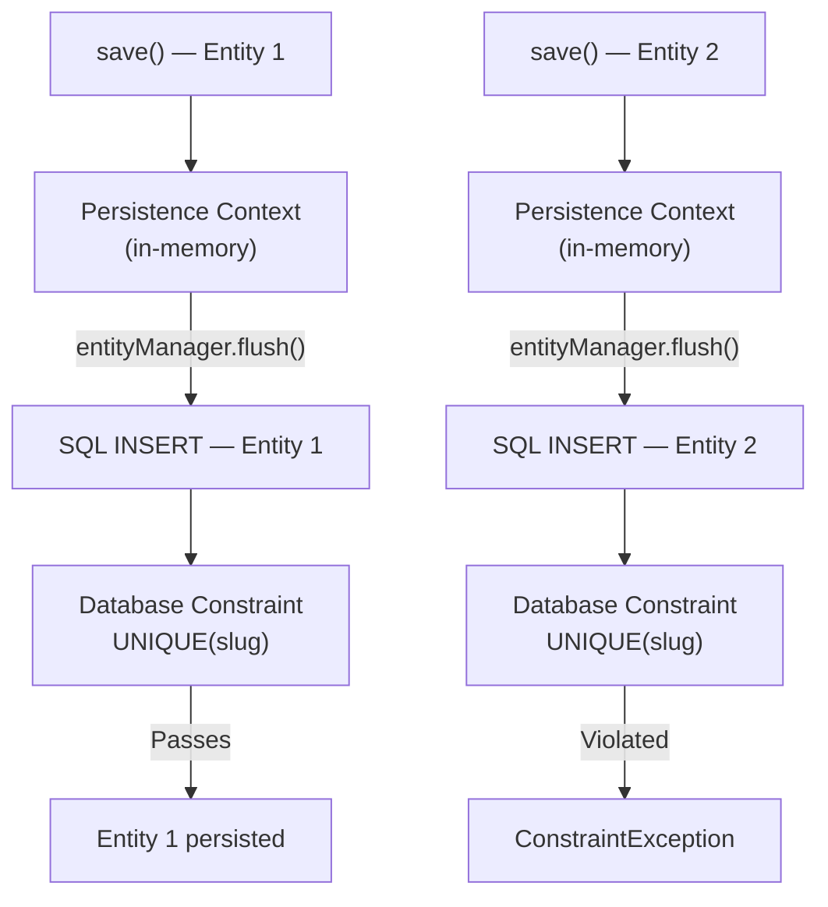

### Enterprise Significance

This is an important JPA testing concept because:

1. **Persistence context ≠ database** — Entities in the persistence context are not guaranteed to be in the database until flushed
2. **Constraint enforcement requires SQL execution** — Database constraints are only checked when the corresponding SQL statement executes
3. **Transaction boundaries affect visibility** — Within a single transaction, other transactions cannot see unflushed changes
4. **`@DataJpaTest` transactions do not auto-flush before assertions** — Unlike `@SpringBootTest`, the sliced test context does not automatically flush before test assertions

---

## 20. Configuration

### Production (`application.yml`)

```yaml
spring:
  datasource:
    url: jdbc:postgresql://${POSTGRES_HOST:localhost}:${POSTGRES_PORT:5432}/${POSTGRES_DB:cicd}
    username: ${POSTGRES_USER:cicd}
    password: ${POSTGRES_PASSWORD:cicd}
    driver-class-name: org.postgresql.Driver
    hikari:
      maximum-pool-size: 10
      minimum-idle: 2
      idle-timeout: 300000
      connection-timeout: 10000
  jpa:
    hibernate:
      ddl-auto: validate
    show-sql: false
    open-in-view: false
    properties:
      hibernate:
        format_sql: true
  flyway:
    enabled: true
    locations: classpath:db/migration
    baseline-on-migrate: false
    validate-on-migrate: true
server:
  port: ${SERVER_PORT:8081}
  shutdown: graceful
management:
  endpoints:
    web:
      exposure:
        include: health,info
```

Key production settings:
- **`ddl-auto: validate`** — Hibernate validates schema, never modifies it
- **`flyway.enabled: true`** — Flyway manages all schema migrations
- **`open-in-view: false`** — Prevents lazy-loading outside transaction boundaries (enterprise best practice)
- **`shutdown: graceful`** — Enables graceful shutdown with 20-second timeout
- **Environment variables** — All sensitive values (database credentials, ports) are externalized via `${ENV_VAR:default}` syntax

### Test (`application-test.yml`)

```yaml
spring:
  jpa:
    hibernate:
      ddl-auto: create-drop
    show-sql: true
  datasource:
    url: jdbc:h2:mem:testdb;DB_CLOSE_DELAY=-1;DB_CLOSE_ON_EXIT=false
    username: sa
    password:
    driver-class-name: org.h2.Driver
  flyway:
    enabled: false
```

Key test settings:
- **`ddl-auto: create-drop`** — Hibernate creates the schema at startup and destroys it at shutdown
- **`flyway.enabled: false`** — Migrations are skipped because Hibernate manages the test schema
- **`show-sql: true`** — SQL logging is enabled for debugging
- **`DB_CLOSE_DELAY=-1`** — Prevents H2 from closing the in-memory database between test classes

### Why Different Strategies

Production requires **schema stability** — a misplaced DDL statement could corrupt data. `ddl-auto: validate` with Flyway ensures all changes go through reviewed, version-controlled migrations. Tests require **schema freshness** — each test class starts with a clean database. `ddl-auto: create-drop` provides this automatically without the overhead of running migrations.

---

## 21. Build and Verification

### Running Tests

```bash
mvn test
```

This command compiles the project, runs all 8 test classes, and reports results. It verifies:
- Application context loads successfully
- Service business rules are correct
- REST endpoints return expected responses
- Database constraints prevent invalid data
- All 14 entity types persist and query correctly

### Building the Artifact

```bash
mvn package -DskipTests
```

This command compiles the project and produces a Spring Boot executable JAR at `target/cicd-control-plane-0.1.0.jar` without running tests. It verifies:
- All source code compiles without errors
- Maven dependency resolution succeeds
- Spring Boot repackage produces a valid fat JAR

### Verified Result

```
Tests run: 45, Failures: 0, Errors: 0, Skipped: 0
BUILD SUCCESS
```

---

## 22. Production Readiness Assessment

| Area | Status | Notes |
|------|--------|-------|
| Domain model | Complete | 14 entities with full JPA mappings |
| Database migration | Complete | Flyway V1 with 14 tables, 32 indexes, 7 unique constraints |
| Repository layer | Complete | 14 repositories with custom query methods |
| CRUD services | Complete | 4 services with business-rule validation |
| REST controllers | Complete | 4 controllers + health endpoint, 13 endpoints total |
| DTO architecture | Complete | 10 DTOs with validation and transformation |
| Exception handling | Complete | Global handler with 5 HTTP status mappings |
| Unit tests | Complete | 19 tests across 4 service test classes |
| Integration tests | Complete | 25 tests across 3 integration test classes |
| Production PostgreSQL | Configured | HikariCP pool, environment-variable externalization |
| H2 test compatibility | Resolved | Dialect auto-detection, TEXT columns, no @Lob |
| Authentication | Not in Module 1 | Deferred to future module |
| Authorization | Not in Module 1 | Deferred to future module |
| Pipeline execution | Not in Module 1 | Deferred to future module |
| Worker execution | Not in Module 1 | Deferred to future module |
| Messaging (RabbitMQ) | Not in Module 1 | Connection configured; publishing deferred |
| Docker builds | Not in Module 1 | Deferred to future module |
| Azure deployment | Not in Module 1 | Deferred to future module |
| CI/CD optimization | Not in Module 1 | Deferred to future module |

---

## 23. Security Considerations

### Currently Implemented

- **DTO boundaries** — JPA entities are never exposed directly to API consumers; response DTOs control exactly which fields are serialized
- **SQL injection protection** — All queries use JPA parameterized statements (Hibernate query parameter binding)
- **Input validation** — Request DTOs use `@Valid` with `@NotBlank`, `@NotNull`, and `@Size` constraints
- **Credential externalization** — Database credentials are stored in environment variables, never in source code
- **Health endpoint** — Returns component status without exposing connection strings or credentials

### Future Security Requirements

- **Authentication** — Not implemented; all endpoints are currently open
- **Authorization** — No role-based access control exists
- **Rate limiting** — No request throttling is configured
- **HTTPS** — TLS termination is expected at the infrastructure layer (load balancer / reverse proxy)
- **Secret management** — Environment variables should be replaced with Azure Key Vault or equivalent in production
- **Audit event sensitivity** — `AuditEvent.metadata` may contain sensitive operation details; future modules should implement access controls and retention policies

---

## 24. Observability and Auditability

### AuditEvent

The `audit_events` table provides a complete, immutable record of significant platform actions. Each event captures:
- **Who** performed the action (`actor`)
- **What** action was performed (`action`)
- **Which** resource was affected (`resource_type` + `resource_id`)
- **When** it occurred (`created_at`)
- **Where** from (`ip_address`, `user_agent`)
- **Context** for distributed tracing (`correlation_id`)

### Pipeline Execution Tracking

The `pipeline_runs`, `pipeline_stages`, `pipeline_jobs`, and `job_attempts` tables form a hierarchical execution record that supports:
- Run duration analysis (`started_at` to `finished_at`)
- Stage-by-stage execution breakdown
- Job-level failure analysis with exit codes
- Retry pattern analysis through attempt records
- Worker assignment tracking via `worker_id`

### Event-Driven Observability Foundation

- `outbox_events` — When paired with a future publisher module, provides guaranteed event delivery for operational monitoring
- `webhook_events` — Records all incoming webhook traffic for debugging integration issues
- `deployments` — Tracks deployment lifecycle across environments with rollback status

### What Is Not Implemented

Module 1 does not implement monitoring dashboards, log aggregation, alerting rules, or metrics collection. These capabilities require infrastructure-level setup (e.g., Prometheus, Grafana, ELK stack) that is outside the scope of the domain model module.

---

## 25. Enterprise Design Decisions

### Decision 1 — PostgreSQL as Production Database

**Context:** The CI/CD platform requires a reliable, feature-rich relational database for production workloads.

**Decision:** Use PostgreSQL as the production database.

**Reason:** PostgreSQL provides JSONB for flexible schema fields, partial indexes for efficient outbox polling, `TIMESTAMPTZ` for timezone-safe timestamps, and proven reliability for concurrent workloads. It is also the most widely supported database in Azure (Azure Database for PostgreSQL).

**Trade-offs:** PostgreSQL is heavier than embedded databases like H2 or SQLite. This is acceptable because production workloads require durability, concurrency, and advanced indexing.

### Decision 2 — Flyway for Schema Migration

**Context:** The database schema will evolve as new modules are added. Schema changes must be version-controlled, auditable, and reproducible across environments.

**Decision:** Use Flyway for all database schema migrations.

**Reason:** Flyway integrates natively with Spring Boot, supports checksum validation to detect corrupted migrations, and provides a clear versioning scheme. Unlike Hibernate's auto-DDL, Flyway migrations are explicit, reviewable, and production-safe.

**Trade-offs:** Flyway adds a build step and requires developers to write SQL migrations rather than relying on automatic schema generation. This is a worthwhile trade-off for schema safety.

### Decision 3 — Hibernate `ddl-auto=validate` in Production

**Context:** Hibernate can automatically create, update, or validate database schemas. Each strategy has different risk profiles.

**Decision:** Use `ddl-auto: validate` in production.

**Reason:** Automatic schema modification (`update`, `create-drop`) risks data loss or unintended schema changes in production. `validate` ensures the application and database are always in sync while preventing Hibernate from executing any DDL statements. All schema changes must go through Flyway.

**Trade-offs:** Developers must write explicit Flyway migrations for every schema change. This adds friction but prevents production incidents.

### Decision 4 — H2 for Repository Integration Testing

**Context:** Integration tests need a real database to verify SQL constraints, but external database dependencies slow tests and complicate CI.

**Decision:** Use H2 in-memory databases for all `@DataJpaTest` and `@SpringBootTest` tests.

**Reason:** H2 starts in milliseconds, requires no infrastructure, and supports PostgreSQL compatibility mode. Test databases are destroyed after each test class, ensuring complete isolation.

**Trade-offs:** H2 is not 100% compatible with PostgreSQL (as demonstrated by the `jsonb`, `@Lob`, and dialect issues). Tests must be designed to avoid H2-incompatible features, and PostgreSQL-specific behavior should be verified in staging environments.

### Decision 5 — UUIDs for Entity Identifiers

**Context:** Entity identifiers must be unique, non-sequential, and safe for external exposure.

**Decision:** Use UUIDs (auto-generated via `GenerationType.UUID`) for all 14 entity primary keys.

**Reason:** UUIDs prevent enumeration attacks (guessing the next ID), support distributed ID generation without coordination, and are safe to expose in API responses. The 128-bit space eliminates collision risk.

**Trade-offs:** UUIDs are larger than sequential integers (16 bytes vs 4-8 bytes), which slightly increases index size. They are also not human-readable, which can make debugging marginally harder. These trade-offs are acceptable for an enterprise API.

### Decision 6 — DTOs at the API Boundary

**Context:** JPA entities contain lazy-loading proxies, internal relationships, and implementation details that should not be exposed to API consumers.

**Decision:** Use Java record-based DTOs for all API request and response payloads.

**Reason:** DTOs provide a stable API contract independent of entity internals. They prevent accidental lazy-loading exceptions (N+1 queries), control field exposure (e.g., not exposing the `organization` proxy from `Project`), and enable validation annotations specific to the API contract.

**Trade-offs:** DTOs add mapping code (the `from()` factory methods). For Module 1's scale, hand-written mapping is simpler and more transparent than adding a mapping library like MapStruct.

### Decision 7 — Database Constraints in Addition to Application Validation

**Context:** Application-level validation can be bypassed through direct database access, concurrent requests, or future API endpoints.

**Decision:** Implement CHECK constraints, unique constraints, and foreign keys at the database level, in addition to application-level `@Valid` annotations.

**Reason:** Database constraints are the last line of defense for data integrity. They protect against application bugs, race conditions, and unauthorized data access. In an enterprise system, the cost of data corruption far exceeds the cost of redundant validation.

**Trade-offs:** Database constraints produce less user-friendly error messages than application-level validation. The `GlobalExceptionHandler` handles database-level constraint violations through the catch-all `500 INTERNAL_ERROR` response. Future modules can add more specific handling for unique constraint violations.

---

## 26. Failure Analysis / Engineering Lessons

### Lesson 1 — PowerShell Command Quoting

**Problem:** Running `mvn test` through PowerShell failed with parsing errors when using `&&` as a command separator.

**Root Cause:** Windows PowerShell 5.1 does not support `&&` as a statement separator (this is a Bash feature).

**Solution:** Use `;` or separate `bash` tool calls instead of chaining with `&&`.

**Lesson:** Cross-platform shell syntax differences can block CI workflows. Always test build commands on the target platform.

### Lesson 2 — Hardcoded PostgreSQL Dialect

**Problem:** Tests failed with SQL syntax errors when Hibernate generated PostgreSQL SQL for an H2 database.

**Root Cause:** `application.yml` hardcoded `spring.jpa.properties.hibernate.dialect=org.hibernate.dialect.PostgreSQLDialect`, forcing PostgreSQL SQL generation regardless of the actual database.

**Solution:** Removed the hardcoded dialect. Spring Boot auto-detects the dialect from the JDBC driver.

**Lesson:** Never hardcode database-specific configuration that should be auto-detected. Environment-specific values should come from profiles or auto-configuration.

### Lesson 3 — `jsonb` Incompatibility

**Problem:** JPA entities with `columnDefinition = "jsonb"` failed to create tables on H2.

**Root Cause:** H2 does not support the PostgreSQL `jsonb` type.

**Solution:** Changed `columnDefinition` to `"TEXT"` in JPA entities. PostgreSQL handles JSON content in TEXT columns at the application level.

**Lesson:** JPA entity annotations must be compatible with all databases used in the application lifecycle, including test databases.

### Lesson 4 — `@Lob` / `oid` Incompatibility

**Problem:** `OutboxEvent.payload` using `@Lob` caused H2 to map the field to an `oid` type, which is not a standard SQL type.

**Root Cause:** Hibernate maps `@Lob` to `oid` on H2, which is a PostgreSQL-specific internal type that H2 emulates incorrectly.

**Solution:** Replaced `@Lob` with `@Column(columnDefinition = "TEXT")`.

**Lesson:** `@Lob` has different behavior across JPA providers and databases. Explicit `columnDefinition` provides more predictable cross-database behavior.

### Lesson 5 — Unique Constraint Tests Not Flushing

**Problem:** Three unique-constraint tests passed when they should have thrown exceptions.

**Root Cause:** `@DataJpaTest` wraps tests in transactions. `save()` adds entities to the persistence context without issuing SQL. Without an explicit flush, the duplicate entity never hits the database, and the constraint is never checked.

**Solution:** Added `entityManager.flush()` after the initial `save()` and inside the `assertThrows` lambda.

**Lesson:** Database constraints are only enforced when SQL executes. In JPA testing, you must explicitly flush the persistence context to trigger constraint checks.

### Lesson 6 — Persistence Context vs. Database State

**Problem:** Entities visible in the persistence context are not necessarily in the database.

**Root Cause:** JPA's first-level cache (persistence context) holds entities in memory. SQL statements are batched and deferred until a flush or commit occurs.

**Solution:** Understanding the distinction between persistence context state and database state is essential for writing correct JPA tests. Use `entityManager.flush()` to synchronize the two.

**Lesson:** The JPA persistence context is a write-behind cache. Test assertions about database constraints must account for this deferred execution model.

---

## 27. End-to-End Request Flow

The following diagram shows the complete request flow for creating an organization, one of the implemented CRUD operations.

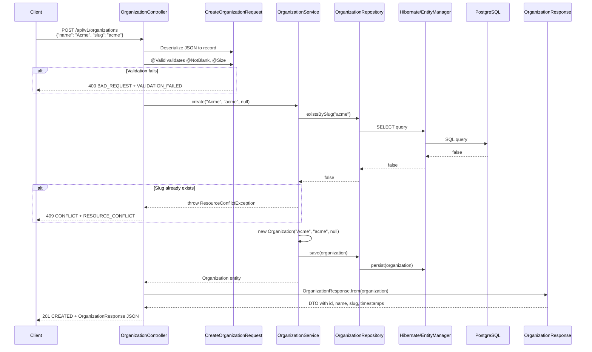

---

## 28. Database Lifecycle

### Production Lifecycle

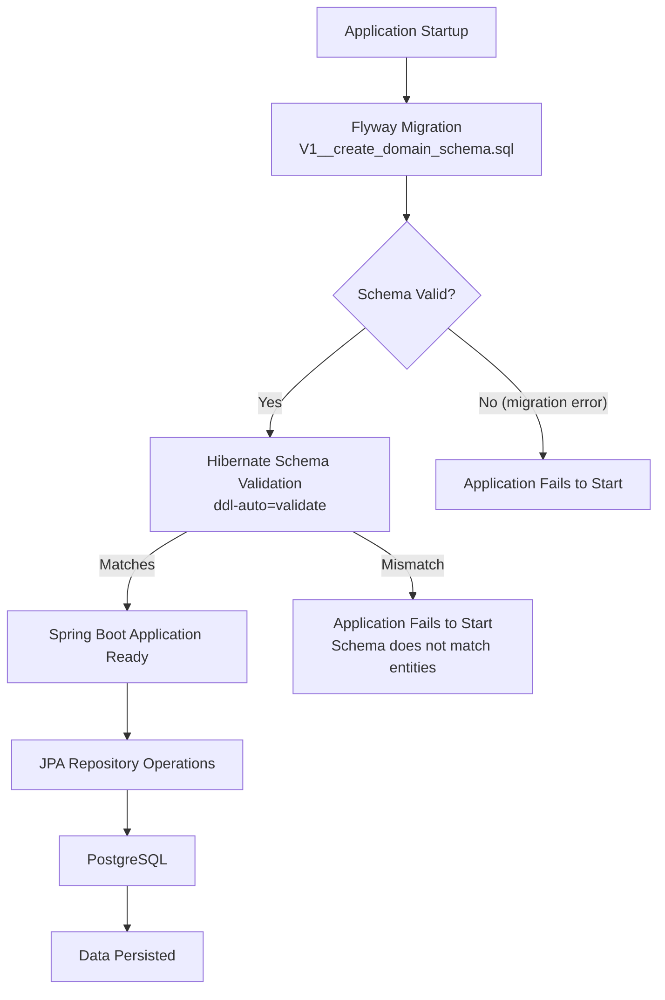

### Test Lifecycle

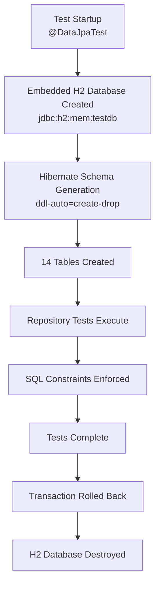

---

## 29. Module Dependencies

### What Module 1 Depends On

Module 1 is a **foundational module** with minimal external dependencies:

- **Spring Boot 3.3.5** — Framework and auto-configuration
- **Java 21** — Language runtime
- **PostgreSQL Driver** — JDBC connectivity
- **H2** — Test database
- **Flyway** — Schema migration
- **Spring Data JPA** — Repository abstraction
- **Hibernate** — ORM implementation
- **Jakarta Validation** — Input validation
- **Spring AMQP** — RabbitMQ connectivity (configured but not actively used in Module 1)
- **Spring Boot Actuator** — Health endpoint

### What Future Modules Will Depend On

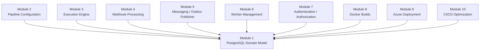

All future modules depend on Module 1 because they operate on the domain model, use the repository layer, and produce data that persists to the 14 tables established here.

---

## 30. What Module 1 Enables

Module 1 makes the following capabilities possible:

- **Creating organizations** — Multi-tenant isolation with slug-based identification
- **Creating projects** — Business-unit grouping within organizations
- **Registering repositories** — Connecting Git providers (GitHub, GitLab, Bitbucket) to the platform
- **Defining pipelines** — Creating CI/CD workflow definitions within projects
- **Tracking pipeline versions** — Immutable version history of pipeline configurations
- **Recording pipeline runs** — Capturing execution instances with commit SHA, branch, and trigger type
- **Tracking stages and jobs** — Hierarchical execution tracking from runs through stages to jobs
- **Recording retry attempts** — Granular retry tracking with exit codes and log locations
- **Recording artifacts** — Tracking build outputs including Docker images and packages
- **Recording deployments** — Tracking deployment lifecycle across environments
- **Recording audit events** — Immutable audit trail with correlation IDs for distributed tracing
- **Storing webhook events** — Idempotent webhook ingestion with delivery-based deduplication
- **Queuing outbox events** — Transactional outbox pattern for guaranteed event delivery
- **Health monitoring** — Database and RabbitMQ connectivity verification
- **Supporting future event-driven orchestration** — The outbox and webhook tables provide the foundation for pipeline trigger automation

---

## 31. Next Module

Module 1 establishes the persistence foundation for the CI/CD platform. The next module should build on top of this domain model by implementing one of the following capabilities (in recommended priority order):

1. **Authentication & Authorization** — Secure the API endpoints with JWT/OAuth2 and role-based access control
2. **Webhook Processing** — Implement the processing logic for `webhook_events` to automatically trigger pipeline runs
3. **Pipeline Orchestration** — Implement the execution engine that drives `pipeline_runs` through stages and jobs
4. **Outbox Publisher** — Implement the polling publisher that delivers `outbox_events` to RabbitMQ

Each of these modules will use the 14 entity tables, 14 repositories, and service abstractions established in Module 1 without requiring changes to the existing domain model.
